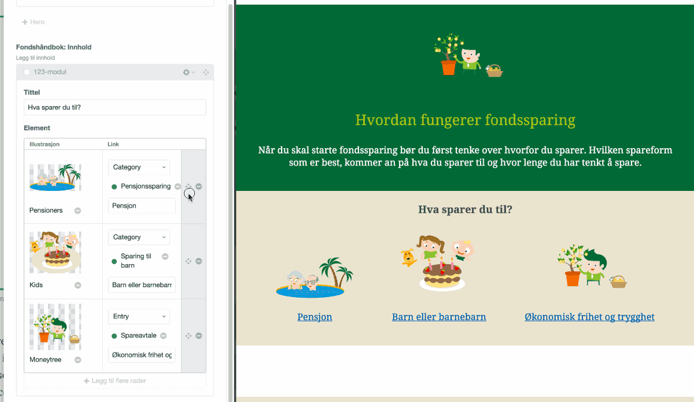
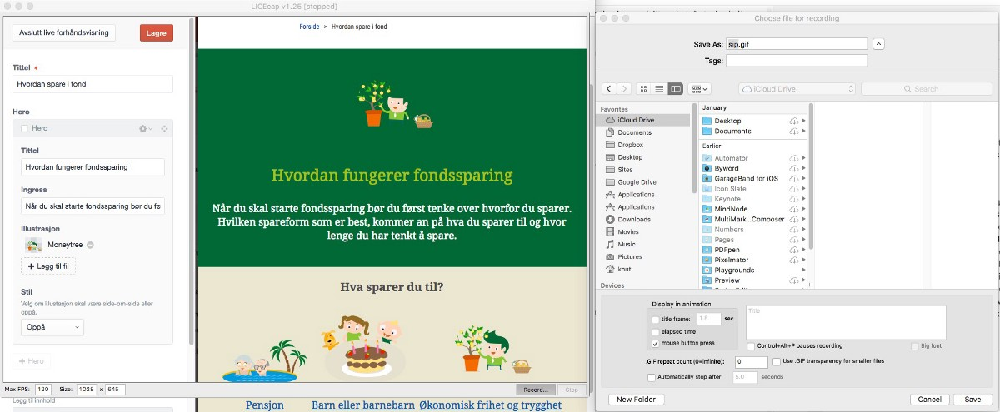

_Keeping stuff too close to the chest is a design anti-pattern. With animated GIFs of your design work-in-progress you can share light weight snippets with your clients. Here’s how._

When I started at [Netlife Research](https://www.netliferesearch.com) there were this ongoing discussion on how we should better involve our clients in the project processes. We used Basecamp for most projects, which allowed for file sharing and comments, but it was easy to neglect when entering the production phase. There were also some concerns about involving the client too early in the design process, because they might get the wrong expectations. I think most designers and developers can feel familiar with wanting to avoid showing things too early.

Keeping stuff too close to the chest is however a design anti-pattern. Design is also about communication and properly understanding the problems you want to solve, and since we solve problems for our clients, we are dependant on their insights and domain knowledge. They also need time to get accustomed to new ideas, and to come up with useful feedback. Since involving some of our clients in project channels in Slack, we’ve been able to do this more continuously throughout the project.

We often set up a working staging site as soon as possible, and work synchronously with information architecture, content, frontend, graphic- and interaction design. We invite the client to log in, and begin to work with content, though some clients find it a bit challenging when e.g. the frontend isn’t ready. Since we now mostly design websites from a design system consisting of _components_, _modules_ and _compositions_, the frontend is implemented pretty granularly. This means that we can communicate to the client that there’s “a new thing”. Here is where animated gifs has become a helpful way to demonstrate how stuff works, especially from within the CMS.

Demonstrating new frontend modules at an early stage. This also works as documentation for how the client can use the CMS.

There’s a handful of [niftly](https://getkap.co/) [little](http://recordit.co/) [apps](https://itunes.apple.com/us/app/gifgrabber/id668208984?mt=12) that let you take a screen recording and save it as a animated gif. However, the one I always return to is [LICEcap](http://www.cockos.com/licecap/). It has some nice settings (e.g. show mouse clicks), but the killer feature is that it records the gif straight to the file, which means that the file is ready to go as you are done with the recording. Most of the other apps I’ve tried require some amount of time to convert and compress the GIF-file after the recording.

LICEcap is perhaps not “sexy”, but it’s reliable.

These short snippets showing some specific functionality also allows for a more fruitful discussion. Showing interaction also helps frame the feedback to what happens, instead of the typical dump of feedback on unfinished things that often come when you just share a static screen shot or let clients loose on the development website without guidance.

There’s a caveat though. This approach assumes that you have established a good relationship with your client (I recommend reading [Mike Monteiro](https://medium.com/u/41d2ecc0ae5)’s [_Design is a Job_](https://abookapart.com/products/design-is-a-job) _and_ [_You’re my Favourite Client_](https://abookapart.com/products/youre-my-favorite-client)_)_, and that they understand that the design process consists of experimentation, continuous change and throwing things out – something this involvement will make very evident. Communicating this process so directly will also require more of you, but ultimately, I think that is a good thing. Posting animated gifs in Slack will not do the job in discussing design with your client for you, but it sure helps.

**How do you share and discuss work in progress with your clients?**