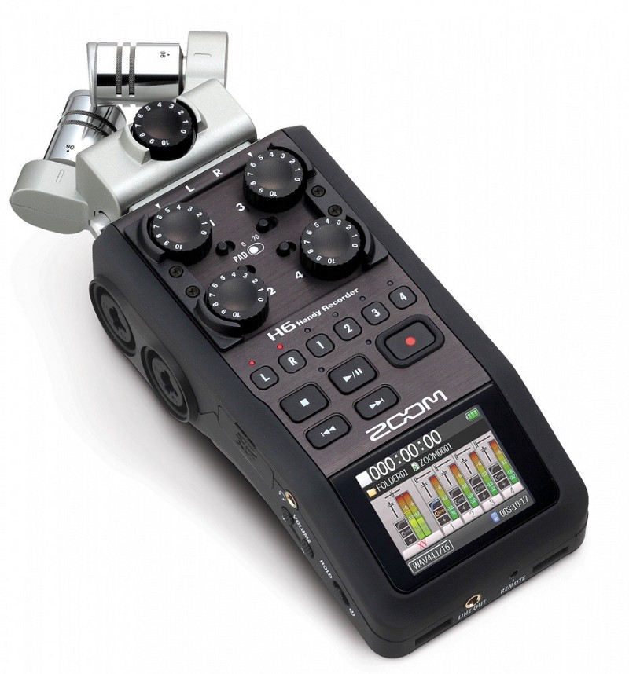

_There are many types of podcasting, and certainly not one correct recipe. This one is ours._

[_Small Differences_](https://smalldifferences.fireside.fm)  was born out of [Chris Atherton](https://medium.com/u/e8016ceb462)’s Twitter account [@smaforskjeller](https://twitter.com/smaforskjeller), where she posted small snippets of her observations about moving from Scotland to Norway, and Knut’s interest in the idea of “[the narcissism of small differences](https://en.wikipedia.org/wiki/Narcissism_of_small_differences)”, plus the additional challenges of making a podcast in English (Knut) and just making a podcast (Chris). It also helps that Chris and Knut have something of a shared sensibility when it comes to the many obscure references and 🐰🕳🕳 (that’s [_rabbit holes_](http://www.urbandictionary.com/define.php?term=Rabbit%20Hole), plural).

### Preparation, or the lack thereof

The birth of _Small Differences_ was in a shared Google Docs that, not long after the original idea sparked, had grown into a pretty elaborate list of topics, questions and links to things to discuss. We usually pick some topics from the list and place them in the upcoming episode session. We don’t follow this slavishly though, but allow for other topics to arise organically out of the conversation. It’s mostly a useful list of references and ideas; also a mental safety net.

### Equipment

The general rule of thumb when it comes to podcasting is to get whatever is recording your voice as close to your mouth as possible without actually swallowing it. Recording into your laptop mic will not cut it; recording into your AirPods is slightly better, but will leave your voice sounding thin and metallic: listen to the difference between our pilot episode, where Chris was recording with [a decent pair of mic’d headphones](http://m.bowers-wilkins.com/shop/headphones/P7-Wireless.html) (headphones are nonetheless important for [self monitoring](https://www.youtube.com/watch?v=Dzd44AyCGh0)), and episode 3, after she got a better mic. Many podcasters (including Chris) trust the good ol’ [Blue Yeti](http://www.bluemic.com/products/yeti/) 🎙, while Knut uses a slightly more elaborate setup with a [Shure SM58](http://www.shure.com/americas/products/microphones/sm/sm58-vocal-microphone) 🎤 connected to a [Zoom H6](https://www.zoom-na.com/products/field-video-recording/field-recording/h6-handy-recorder). (When we record together in the same room, we use Knut’s setup.)

The Zoom H6 is a workhorse, but don’t use the included microphones unless you want all the sounds from your surroundings.

The rule for your other thumb is that you want to record as _little_ of everything that is not your voice as possible. Here is where many podcasters overlook their surroundings. Our tip is to first listen to the [99 Percent Invisible podcast](http://99percentinvisible.org/) — more specifically, their episode on [reverb](http://99percentinvisible.org/episode/reverb-evolution-architectural-acoustics/) — and start to really listen how sound… sounds different in different rooms. Since neither of us has spent money on proper sound panels (yet), we just use soft furnishings behind the microphone to absorb the sound when it has passed the microphone. It’s not building a pillow fort — it’s sophisticated sound engineering.

### Recording

When we record remotely (i.e. not in the same room as each other, but via Skype), we each record our own end of the conversation directly from the microphone to get the best uncompressed, clean sound. This is called a double-ender, if you enjoy that kind of thing. Additionally, Knut uses [Ecamm recorder](http://www.ecamm.com/mac/callrecorder/) to record the Skype conversation as two separate tracks. This way, when we come to edit, we can use Knut’s dual Skype tracks as a visual reference point, aligning the waveforms with the sound file Chris recorded at the other end — and then delete Knut’s version of Chris, which is almost certainly noisier and/or contains Skype’s signature mangling of the space-time continuum. It’s also good to have Knut’s extra copy as a backup in case anything got screwed up during the recording.

It’s easier to record a conversation over video. Ecamm Recorder lets you export the audio tracks separately.

### Edit and bouncing

Chris edits the episodes in [Garageband](http://www.apple.com/mac/garageband/), while Knut (who is fancy) uses [Logic Pro](https://www.apple.com/logic-pro/). Since editing is mostly just adjusting for [drift](https://larryjordan.com/articles/solving-problems-caused-by-audio-sample-rates-that-dont-match/) and cutting out some of the more awkward pauses (i.e. while we’re googling stuff during the show or, sometimes, spilling our drinks), both are perfectly suitable for the job. If there’s been a problem with the sound (background buzzing or the like) Knut uses some [filter](https://www.izotope.com/) to fix it (more or less) in Logic. We also use a [compressor](https://music.tutsplus.com/tutorials/the-beginners-guide-to-compression--audio-953) and [limiter](https://music.tutsplus.com/tutorials/a-beginners-introduction-to-limiters--audio-1071) to compensate for bad microphone technique. The compressor evens out the low and high signals, and the limiter reduces the loud noises (e.g. when Chris burst out in laughter).

We don’t really edit that much.

The episode is usually bounced to a 96 kbps mono mp3 file. Why? Because the recording is mostly voice, so it doesn’t need much dynamic range (there’s enough of that in the hosts’ personalities already), and we don’t want people to have to download or stream large files on their cellular data plans. The final touch is to add chapters to the mp3 file with the [Podcast Chapters](http://chaptersapp.com/) app. We use mp3 format because it’s supported by literally every digital music player out there, and works best with the chapters app.

Podcast Chapters has plenty of nifty features, but is somewhat lacking in the UX department.

### Publishing

There are many ways to publish a podcast. You can use either [Squarespace](https://squarespace.com), [Soundcloud](https://soundcloud.com), a Wordpress plugin, [podbean](http://www.podbean.com) or a supercool service called [Cast](https://tryca.st) (that lets you both record, edit and publish in the web browser). You need to host it somewhere in order to add it to the iTunes Directory. And you want to do that, because most podcatchers use the iTunes Directory as their source for podcast listings and so on. When it comes down to it, a podcast is really just an audio file that is published in a RSS-feed with some specific metadata.

Go to any site, click the bookmark, and inserts links directly to the episode show notes.

We use [fireside.fm](https://fireside.fm/), mainly because it’s tailor-made for podcast publishing, but also because it’s made by 5by5 creator Dan Benjamin, who is sort of a podcast production guru to us. He’s earned that trust by making some of our favourite podcasts, but also because he’s passionate about podcast quality, especially in the [recording department](http://podcastmethod.co/). Fireside has all that you need for publishing and managing a podcast, including custom cover art, statistics, sponsor handling and access to the Slack-team where you can come with feature requests and get support. Also, the bookmarklet for creating episode links on the fly is fucking genius.

### Easy to get started with…

It’s pretty easy to get started with podcasting. Instead of doing a load of planning, we just recorded a pilot to see if the show could work (at this point we had only ever spoken to each other a few times — most of our conversation had been in Slack). And although that first episode was kinda shonky and the sound quality was pretty terrible, we put it out there for people to listen to and download. And, implausibly, some of them did.

If you’re not used to talking into a microphone while being very aware that it’s also recording you, this might feel a bit weird to begin with. The feeling will soon pass, though. You just need to get used to listening to your own voice, since the best way to get better as a podcast host is to listen to yourself and all those awful (to you) mannerisms you didn’t realise you had. Here’s where your passion (or need for exposure) is necessary, to get past the painful bits. Actually you can pretty much guarantee that most people doesn’t notice or care about that thing you do, the thing you hate and wish you could stop. If there’s something you really can’t bear to hear yourself say or do, write it at the top of your next episode plan. But you do get used to listening to yourself (Knut used to tell Chris that she would stop caring about what she sounded like around the fifth episode. And he was largely right).

### …kind of hard to keep doing

We record pretty much every week, first thing in the morning before work (it being Norway, people routinely start work at 8 or 8.30am. We get up at a time that has a 5 at the start. Your mileage may vary). We chose early mornings because originally we tried recording in the evenings and, as morning people, we were too low-energy. Coffee helps a lot. If you’re recording with someone else, it also helps if you like talking to them enough to want to get out of bed when it’s cold and dark and wet outside in the middle of winter. Sometimes we’re a bit low on energy — it’s hard to be funny and engaging if you’re tired, for example. But having someone else there to talk to forces you to raise your game (and if you really can’t, at least they can poke fun at you). It all pretty much boils down to recording whatever you feel — and I don’t use this word lightly — passionate about. It’s not necessarily about talking passionately, but feeling passionately: the thing that will make you keep doing it _exactly when_ you’re not really up for it and it feels kinda like a drag. If you want listeners, they will expect you to publish frequently and on a regular schedule, so it needs to be something you care enough about to stick with.

Also, sometimes stuff just goes wrong. We’ve started two episodes where the technology failed sufficiently far into the episode (like, 30–45 minutes in) that we had to start over, and it felt like a drag. But once we were recording again we pretty much forgot about the lost recordings, because recording again was still enjoyable.

### Creating a podcast universe

At the time of writing we’ve recorded 19 episodes (including the pilot). During these episodes an array of internal references, mannerisms, jokes and returning segments have evolved. This provides both structure and and a sense of familiarity for regular listeners. And, other than ourselves, they are who we make this show for. Other conversation and/or interview-based podcasts might be better suited for standalone episodes, but we give up that kind of listenability for (hopefully) more rewarding long-term listening. After all, our goal isn’t necessarily to scale an audience, but to learn and explore a meeting between pretty similar — but nevertheless different — cultures through an interesting medium with different constraints than text or a regular conversation. We hope you enjoy it as much as we do.

**Do you have questions or comments on our podcast workflow? Feel free to leave us a comment!** 👇