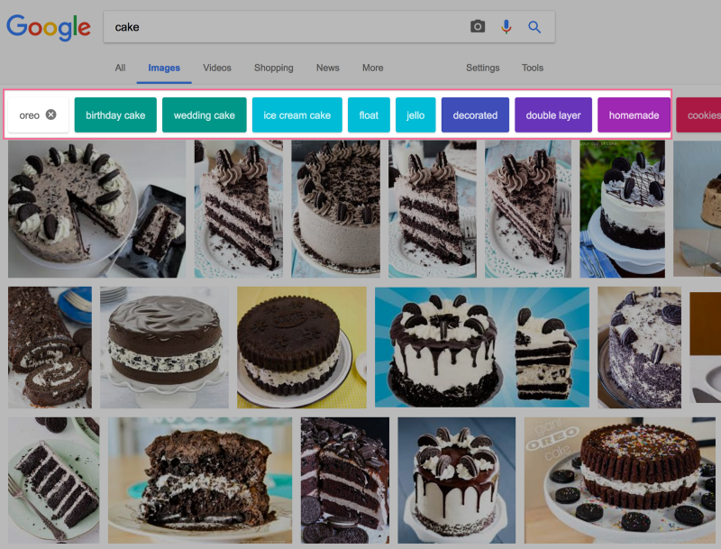
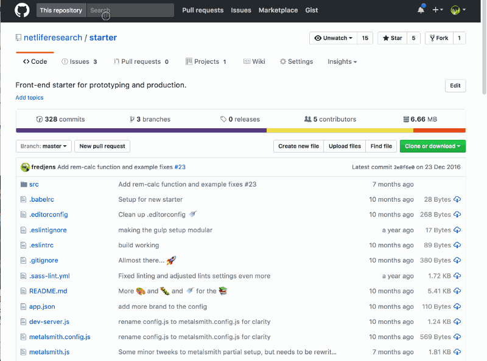

I agree with your approach to search design, but I also want to challenge and nuance this a bit: There’s a subtle difference between having filters as a choice before search, and providing filters for the results you get. For example: [Google does provide filters for a lot of the image search](https://www.google.com/search?site=&tbm=isch&source=hp&biw=1233&bih=1076&q=cacke&oq=cacke&gs_l=img.3..35i39k1j0i10k1j0j0i10k1j0j0i10k1j0j0i10k1l2j0.527.1010.0.1091.6.6.0.0.0.0.63.282.5.5.0....0...1.1.64.img..1.5.279.0.0SkYFcmhguc#tbm=isch&q=cake).

Filters in Google Images

I also want to mention that one of the most powerful search engines out there, namely Github, has a [nice little filter in their search box](https://github.com/netliferesearch/) where it will filter per default to the repository/organisation you’re currently visiting. We recently user tested the latter one for an educational learning resource site we help building and none of our testers (teenagers) had any problems grasping what it did, how to get rid of it, and reported to find it very useful. So, there’s a least two patterns worth exploring before throwing filters out with the design bathwater.

Search filter in GitHub