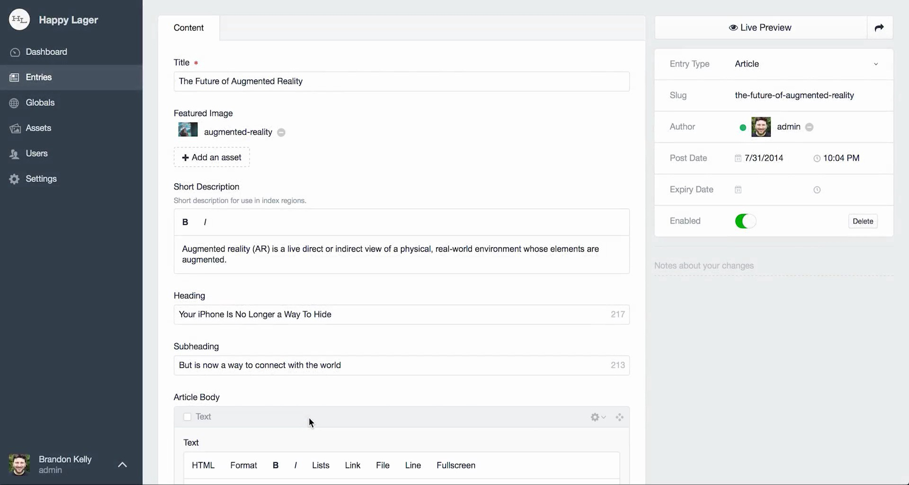

With great flexibilty comes great responsibility.

_Rules of thumb when making a website on the wonderful_ [_Craft_ **_C_**_ontent_ **_M_**_anagement_ **_S_**_ystem_](https://craftcms.com)_. Based on two years of developing Craft-based websites for clients._

This is our opinionated list of principles for [Craft CMS](https://hackernoon.com/tagged/craft-cms). Some are certainly contestable, some are just common sense, and some are the product of trial and error. These principles range from project management, code structuring, to the field and section structure within the Craft control panel.

1\. Start the project with setting up developer, staging and production [environment](https://github.com/vlucas/phpdotenv). This will make the launch way less stressful.

2\. Start early with the information architecture. Work together with people who will be writing content to set up sections and fields. This will allow you to work with real content, and discover needs for features early.

3\. Don’t chase [waterfalls](https://en.wikipedia.org/wiki/Waterfall_model): try to work with graphic design, content and frontend [development](https://hackernoon.com/tagged/development) simultaneously.

4\. If you feel the need for a matrix-block in a matrix-block, reconsider your information architecture. You’re probably doing it wrong.

5\. If you make a “content”-matrix block, keep it simple by avoiding more than six block types.

6. Build your templates up from modules. Keep the HTML in those to allow for both flexibility and consistency. Use them to make page templates. Stay [DRY](https://en.wikipedia.org/wiki/Don%27t_repeat_yourself) and remember to default variables.

Example of a module

7\. If you ending up writing a lot of twig to solve the thing, consider making a [plugin](https://pluginfactory.io) instead (it’s not as difficult as it may seem).

8\. Make sure to discuss, review, show your Craft project to another developer at least once every 40 project hours.

9\. Take the time and write good descriptions for your fields. You will not “just do it later”.

10\. Use image transforms. Think of your users’ bandwidth.

11. Restrict the rich text editor as much as possible. Don’t allow images in it as it creates more complex code and usually allow for bad layout decisions.

12\. Panes are used for hiding stuff that isn’t really that important.

13\. Debugging Craft: Have you introduced a PHP-error in the settings? Have you set the necessary .env-variables? Have you installed all the dependencies? Is there some difference between your development, staging and production enviroment? What do the logs say? Have you messed up the caching? Are you trying to access a field that isn’t there? Have you _really_ read the error message? Have you read the documentation? Have you searched [Stack Overflow](https://craftcms.stackexchange.com/) or asked in the [Craft Slack](https://craftcms.com/community)?

_14\. Singles_ are for unique pages with their own template, whose content isn’t used other places — typically frontpages for listing out channel entries and so on.

_15\. Channels_ are for structured content that either makes sense as a stream, or a group of similar content (e.g. news or products). Channels are also good for content that will be reused in several contexts.

_16\. Structures_ can be useful if you want to have a flexible hiearchy of content, where the hierarchy is important for managing the content.

_17\. Categories_ are mostly used for pure metadata and to connect content across sections.

18\. Use primarily unique and channel sections. Avoid structures. We tend to not use structures because we prefer a [pretty shallow information architecture](https://alistapart.com/article/the-core-model-designing-inside-out-for-better-results) and it’s prone to content entropy.

19\. Some plugins make any Craft project easier: [Admin Bar](https://github.com/wbrowar/adminbar), [CP Field Links](https://github.com/mmikkel/CpFieldLinks-Craft), [Element API](https://github.com/craftcms/element-api), [Kint](https://github.com/mildlygeeky/craft_kint), [Linkit](https://github.com/fruitstudios/LinkIt), [Sprout Fields](https://sprout.barrelstrengthdesign.com/craft-plugins/fields) / [Forms](https://sprout.barrelstrengthdesign.com/craft-plugins/forms/), and [Retour](https://github.com/nystudio107/retour). ([And a bunch more on Awesome Craft](https://github.com/chasegiunta/awesome-craft)).

20. Whatever you do, consider how your choices will affect the client’s ability to make good choices when managing their content, and how easy it will be for your future self to troubleshoot and further develop your code.

Not so much a principle as good advice: keep up to date by subscribe to the [Craft Link List](http://craftlinklist.com) newsletter and listen to the [Craft.Podcast](http://craftpodcast.com).

**_What are your principles for projects on Craft CMS?_**