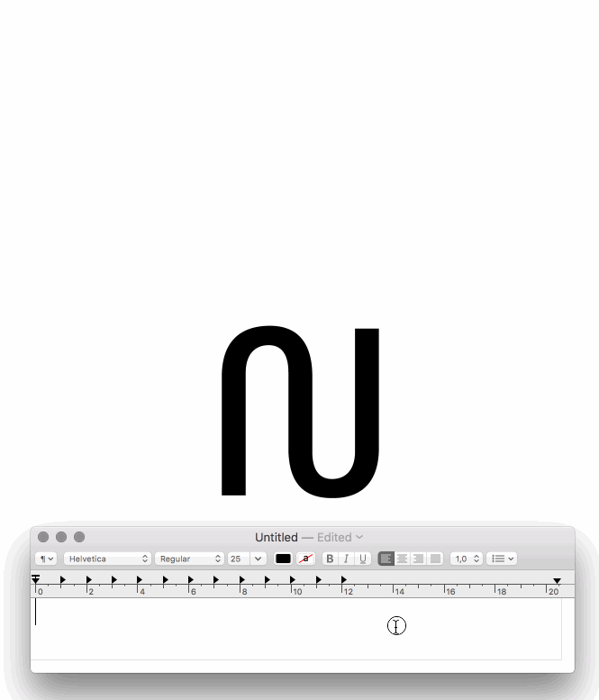
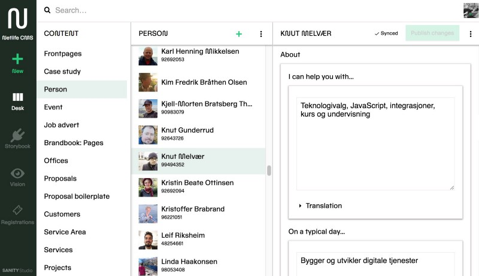

_5 grunner til at vi valgte Sanity som CMS for netlife.com_

[Den nye identiteten til Netlife](https://www.netlife.com/merkevarehandbok/for-folk-av-folk-tankene-bak) er ikke bare visuell, den er også teknologisk. Dette reflekterer at vi har gått fra å være et byrå som først og fremst leverte interaksjons- og grafisk design for web, til å snekre sammen komplette digitale løsninger i både form og funksjon.

I mange år har vi i teknologibransjen hørt snakk om «headless CMS», det vil si systemer hvor innholdet kun er tilgjengelig via et API, og ikke med en påkobla motor for sidemaler. Innholdet i et API gir kun strukturert innhold i en liste og «vet ingenting» om hvordan det skal bli vist. De som promoterer hodeløse CMSer hevder gjerne at det en mer rendyrket måte å forvalte digitalt innhold på, fordi man tar høyde for at det skal vises i forskjellige digitale flater. Det virker også som markedet hører, for de tradisjonelle leverandørene har nå begynt å snakke om «decoupled» som et tilsvar hvor de gjør innholdet i sine CMS mer tilgjengelig gjennom APIer.

De siste årene har vi også jobbet med og anbefalt flere kunder slike hodeløse løsninger. Vi har vært veldig fornøyd med [Craft CMS](https://hackernoon.com/20-principles-for-craft-cms-ae08d80c17de) som det gode, gamle [grønne nettstedet](https://retro.netliferesearch.com) er bygget på, men ville i denne runden utfordre oss selv. Det føltes derfor rett [å tygge sin egen hundemat](https://www.urbandictionary.com/define.php?term=Dog%20fooding).

](img/1__0dil7MamJWLK1F19pFpEsw.jpeg)
Et hodeløst CMS er frikoblet fra visningslagene i motsetning til tradisjonelle CMS, hvor innholdet og sidemalverket er knyttet tett sammen. Illustrasjon fra [sanity.io/docs](https://sanity.io/docs)

Vi hadde så vidt startet arbeidet i en annen løsning da Oslo-byrået [Bengler](https://bengler.no) kom innom og spurte om vi ville teste ut [Sanity](https://sanity.io), et hodeløst CMS de har utviklet de siste tre årene og nå startet en egen bedrift for. Jeg var solgt da jeg brukte mindre enn én dag [med litt enkel JavaScript](https://www.sanity.io/docs/reference/schema-types) på å reprodusere informasjonsarkitekturen vi hadde klikket oss frem til i kontrollpanelet i den andre løsningen. Til tross for at redaksjonsgrensesnittet var i beta, tok vi sjansen og hoppet på. Nå er [netlife.com](https://www.netlife.com) lansert som et løsrevet nettsted i [Next.js](https://zeit.co/blog/next4) som henter alt innholdet sitt via et API. Vi er allerede i gang med flere kundeprosjekter på Sanity, med flere i sikte. Her er fem grunner til hvorfor vi ble hodeløst forelsket:

### 1\. Vi kan redigere redaktørgrensesnittet

I alle de årene vi i Netlife har hjulpet kundene våre med å gjøre brukeropplevelsene bedre for deres brukere, så har det vært en stein i skoen: Redaktørsystemene som kundene våre selv må bruke når de skal forvalte innholdet sitt. Vi kan bruke timer på å rydde opp i Wordpress-dashboard-kaos, eller irritere oss over valgene som CMS-leverandøren har tatt for å imøtekomme alle behov. Dette har også vært grunnen til at vi har valgt [Craft CMS](https://craftcms.com) for mange, som gir deg blanke ark, men til gjengjeld et bestemt utvalg av tegnestifter når det kommer til innholdsfelter og struktur i kontrollpanelet.

 til Netlife. Her kan vi direkte i utlistingene av eventene se hvor mange påmeldte vi har.](img/1__ACN2izxZicqxFw8zIYy0Rg.jpeg)
Sanity fungerer også som påmeldingssystemet til [kurs og konferanse-sidene](http://www.netlife.com/kurs-og-konferanser) til Netlife. Her kan vi direkte i utlistingene av eventene se hvor mange påmeldte vi har.

Redaktørgrensesnittet til Sanity, også kalt [_Content Studio_](https://www.sanity.io/docs/content-studio)_,_ er bygget for å kunne tilpasses til akkurat det du trenger, helt ned på innholdsfeltsnivå. Siden det er kodet i React, som de fleste som koder i Netlife er vant med fra frontend-arbeidet, er terskelen utrolig lav. Dette gir uante muligheter til å tilpasse publiseringssystemet til kundens hverdag.

 var det viktig for redaktøren å få bedre kvalitetskontroll på tekstene. Det tok under en time for oss å integrere riktekst-feltene med APIet til [readable.io](https://readable.io) — en tjeneste som analyserer lesbarhet. Resultatet ser du ovenfor, etterhvert vil vi bygge mer funksjonalitet også inn i tekstfeltet.](img/1__h0VovYKNsXjY31vCtHoD8w.gif)
I arbeidet med det nye [U4.no](https://beta.u4.no) var det viktig for redaktøren å få bedre kvalitetskontroll på tekstene. Det tok under en time for oss å integrere riktekst-feltene med APIet til [readable.io](https://readable.io) — en tjeneste som analyserer lesbarhet. Resultatet ser du ovenfor, etterhvert vil vi bygge mer funksjonalitet også inn i tekstfeltet.

### 2\. Alt innholdet er tilgjengelig via et API, akkurat slik du vil ha det

Om du ikke er utvikler kan du fint hoppe over det påfølgende avsnittet. Poenget er at utvikling av informasjonsarkitekturen og det at man slipper å konfigurere hvordan man får ut innholdet i APIet sparer utviklere for enormt mye tid. Den tiden kan man bruke på å lage gode nettsider eller tilpasse redaktørgrensesnittet (som også er enkelt).

En av utfordringene med hodeløse CMS tidligere er at APIet har vært relativt låst til en forhåndsbestemt struktur. Av og til er det akkurat det man trenger, men dersom du skal drive et helt nettsted på det, eller andre mer komplekse innholdsflater, så blir det fort omstendelig å jobbe mot. Om man for eksempel skal vise et blogginnlegg med informasjon om forfatteren, må man gå to ganger til APIet for å spørre om hver enkelt del. Det er derfor Facebook utviklet spørrespråket [GraphQL](http://graphql.org/learn/) som gir deg litt fleksibilitet til å hente ut det du trenger. Sanity kommer med spørrespråket [GROQ](https://www.sanity.io/docs/front-ends/how-queries-work) som ligner litt, men er enklere å lære og gir mer fleksibilitet. Spesielt når du er ute etter å hente ut innhold med relasjoner. For eksempel vil spørrestrengen `*[_type = 'articles']{title, "comments": *[_type = comments && references(^._id)]` se gjennom alle dokumenter av typen «articles» og gi deg tittelen og alle kommentarer som er tilknyttet hver enkelt. Om du ikke leser kode, vis dette til en utvikler du kjenner og vent på «høh»-et.

Sånn ser spørringen «ta alle dokumenter av typen ‘_topics’, gi meg tittelen, og tell opp alle dokumenter av typen ’publication’ og ‘helpdesk’ som viser til hver enkel topics-dokument, sorter alle disse etter antall referanser og gi meg de fem som er på toppen av den lista» ut._

### 3\. Kortreist, bærekraftig og dødskjedelig teknologi

Sanity lover mye. Det skal være i stand til å romme titusenvis av dokumenter; du skal kunne redigere i sanntid i samme dokument (slik som i Google Docs); du skal kunne spore tilbake endringene i dokumentet ditt; hvilket som helst innhold skal kunne hentes ut på millisekund, selv med relasjoner; du skal kunne bygge dine egne datamodeller; og så videre. Det er ikke rart vi også gikk inn med en sunn dose skepsis. Det hjelper å vite at [Bengler](http://bengler.no) har bygget og drevet [Underskog](https://underskog.no) i 12 år, var tidlig ute med det sosiale nettsamfunnet [Origo](http://origo.no/-/site/about) (rett før Facebook var en ting) og har mange teknologiske prosjekter på CVen. De har nå etablert Sanity som en egen bedrift og satser tungt. Under panseret til Sanity finner vi dødskjedelig teknologi som PostgreSQL, ElasticSearch og JavaScript. [Sanity er også åpen kildekode](http://github.com/sanity-io/). Og dødskjedelig, velprøvd og moden teknologi er bra når den skal ta vare på innhold og data som er viktig for organisasjonen din.

### 4\. Hodeløst tvinger deg til å tenke nøye over informasjonsarkitekturen din

Vi skal ikke late som det ikke kan være utfordrende å jobbe med et hodeløst CMS. Det fungerer nemlig best om du klarer å løsrive deg fra digitalt innhold som «sidemaler», menystrukturer, tekst og bilder i en nettleser. Dette er spesielt utfordrende når det tross alt er en nettside man skal lage. Med netlife.com har vi klart det til en viss grad, men måtte allikevel krype til korset og lage et dataskjema for «forsider» hvor vi styrer innholdet som kan knyttes til det øverste laget av [netlife.com](https://netlife.com). På den annen side har vi også skilt ut «Persons» som en egen datatype, som ikke bare [listes ut](https://netlife.com/folka) på nettsiden, men også tas ut i en kjekk liten utvidelse for Mac-appen [Alfred](https://alfredapp.com) (se gif under).

Med kombinasjonen av Sanity og Alfred har jeg nå bedriftsadresseboka noen få taster unna.

### 5\. Vi kunne jobbe smidig uten å være spesielt redd for å feile

Det var en vanvittig utfordring å lage en helt ny visuell identitet innomhus som skal favne to selskaper. Siden sjappa også skal gå rundt, ble det slik at vi begynte å bygge teknologien seinere enn vi skulle ønske, og derfor måtte jobbe fort for å få nettsiden på lufta innen lansering av den nye identiteten. Å hoppe på en relativt uprøvd løsning som Sanity seint i prosjektløpet var derfor å bevisst ta seg vann over hodet, men det var en kalddusj som viste seg veldig lærerrik for oss (og vi lanserte tross alt til fristen innenfor budsjett). Tryggheten var i at vi med én kommandolinje-snutt kunne ta med oss innholdet og gå, og at vi fikk lov til å mase så mye vi ville på Bengler, som trengte tilbakemelding på bugs og ting som burde forbedres.

En av styrkene til Sanity er at det bokstavelig talt tar fem minutter fra du har lastet ned, installert, og startet redaksjonsverktøyet, til du er i gang med å bygge informasjonsarkitekturen med innholdsfelter som andre kan begynne å fylle ut. Som prosjektleder for teknologi kunne jeg gi innholdsfolka tilgang til å jobbe med det reelle innholdet rett i Studio så snart vi hadde redaktørgrensesnittet oppe og noen felter klare. Grunnen til det var at vi trengte å avdekke nye behov for informasjonsarkitekturen i møte med den virkelige verden, og ha ekte innhold for å stressteste det visuelle designet når det ble tatt ut i levende kode. Vi måtte finne ut hva som ikke fungerte så tidlig som mulig.

Denne arbeidsformen er langt fra smertefri, og krever mye tålmodighet fra alle. Spesielt de som må jobbe med tekst uten å umiddelbart kunne se hvordan det tas ut: «Når får vi forhåndsvisning?» ble fort en klisjé. Etterhvert som nettstedet kom på plass, ble også redaksjonsopplevelsen bedre. Neste steg blir å bake forhåndsvisning av forskjellige flater inn i redaktørgrensesnittet. Da kan vi umiddelbart se hvordan innhold tas ut på nettsiden, når det deles på Facebook, eller som respons i en [Alexa-skill](https://developer.amazon.com/alexa-skills-kit).

Utsnitt fra redaktørgrensesnittet vårt.

#### Mist hodet uten å miste sinnet

Vi er teknologi-agnostiske i Netlife, og prøver alltid å finne den teknologien som tjener til å løse problemer innenfor prosjektets rammer: Når det er sagt, vi har blitt forelsket i Sanity fordi det er så enkelt å sette opp, enkelt å tilpasse, og gir oss mulighet til å jobbe med innhold først uten at teknologien kommer i veien. Det passer nok ikke for alle, og dekker ikke alle de forskjellige behovene vi møter i ulike prosjekter, men for organisasjoner og bedrifter som har høye digitaliseringsambisjoner vil det være vanskelig å ikke vurdere Sanity til den delen som har med innholdsforvaltning å gjøre.

Dersom du er nysgjerrig på hvordan det er å jobbe med hodeløse CMS, [ta gjerne kontakt](mailto:dataknut@netlife.com), eller skriv i kommentarfeltet under.