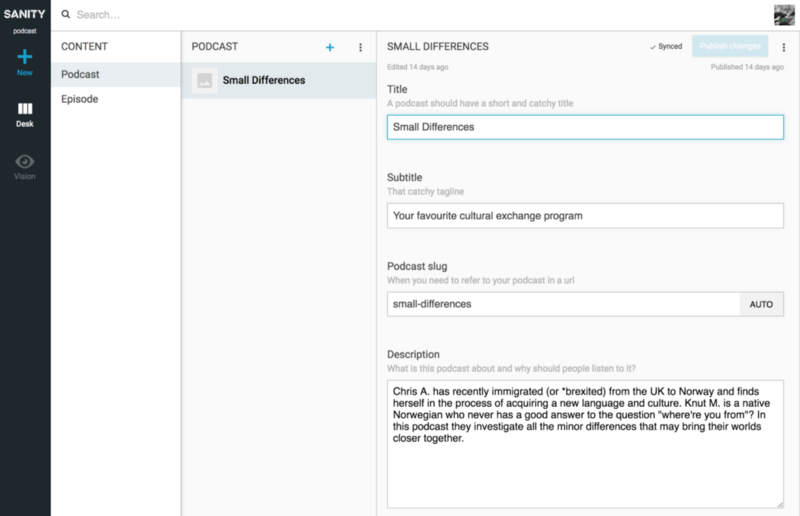
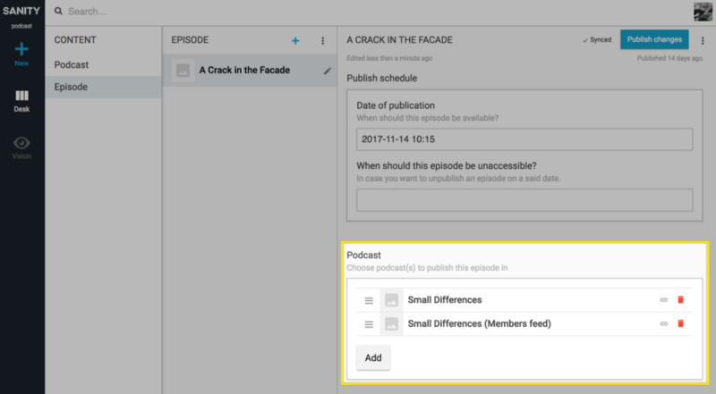
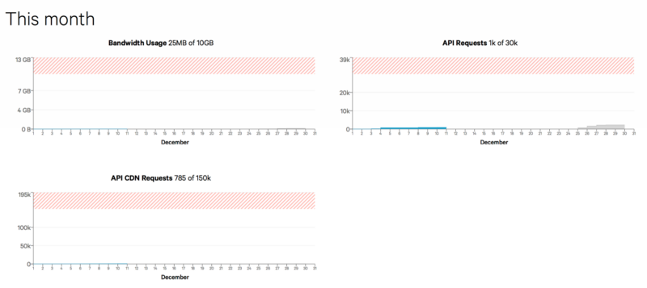

_tl;dr: run_ `_sanity install podcast_` _and follow the instructions on_ [_www.sanitypodcastfeed.com_](https://www.sanitypodcastfeed.com)

[Sanity](https://sanity.io) is a fully customizable, headless [CMS](https://hackernoon.com/tagged/cms) that you can install and get started with within two minutes if you know some basic JavaScript. Just run `npm install -g @sanity/cli && sanity init` to get started, and follow these [instructions](https://www.sanity.io/docs/introduction/getting-started).

It’s also possible to extend and write plugins for Sanity. If you know React you can make your own custom input-fields, or custom tools within the Content Studio. You can also bootstrap content models with ready-to-go fields and content types. I know because I recently did this to make it possible to host your own podcasts (yes, that’s plural) in Sanity. Just run `sanity install podcast` and [**Podcast**](https://hackernoon.com/tagged/podcast) and **Episode** will appear as new content types in your Studio.

Create as many podcasts and episodes as your heart desire

I’m not sure if it even makes sense, but this setup also allows you to connect an episode to _multiple_ podcasts. Perhaps you want an exclusive feed for only paid supporters or the like? Well, now you can!

You can tie an episode to multiple podcasts.

You’ll save your mp3-files in Sanity and have them available on a pretty fast network with CDNs. You also have pretty good control over bandwith use in the [Sanity control panel](https://manage.sanity.io).

This on the free tier

Sanity alone cannot really do all the work however, because it only outputs JSON. That’s generally awesome if you make a website, Alexa-skill or some other stuff, but most podcatchers and directories require a RSS-feed. So I have made that for you as well.

You can either go to [www.sanitypodcastfeed.com](https://http://www.sanitypodcastfeed.com/) and follow the simple instructions there to have your RSS-feed instantly available, or [you can fork, host and tweak](https://github.com/kmelve/sanity-podcast-server) it at your own if more control and customizations is required. It’s just a simple node.js-server that runs Hapi, and transforms the data from Sanity into a RSS-feed.

_The plugin and the podcast feed service is still in beta._ [_Feel free to let me know how it works for you_](https://github.com/kmelve/sanity-plugin-podcast/issues)_, and especially if it doesn’t!_

](img/1__FMjHYIOyVWGs9d9vBqSJLQ.png)
Head over to [www.sanitypodcastfeed.com](https://www.sanitypodcastfeed.com)