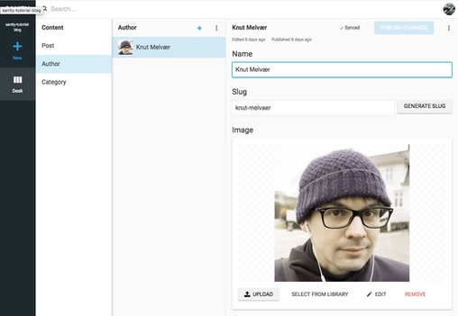

[Sometimes](http://foo.bar/) you just need a blog. While there are loads of blogging platforms, there might be good reasons for having your blog content live along with your other content, be it documentation (as in our case), products, a portfolio or what have you. The content model, or the data schema, for a blog is also an easy place to get started with making something headless with [Sanity](https://hackernoon.com/tagged/sanity) and a detached frontend.

In this tutorial we’ll make a blog with Sanity as the content backend and the React-based framework Next.js for rendering web pages.

If you don’t feel like typing all the below, you can also:

👉 [**Check out the code on Github**](https://github.com/sanity-io/sanity-blog-tutorial) **👈**

### 1\. Install Sanity and the preconfigured blog schemas

If you haven’t already done so, install the Sanity Command Line (CLI) tooling with npm.

```
npm i -g @sanity/cli.
```

This allows you to run the `sanity init` command in your project folder, and indeed, this is the next step. You'll be asked to create an account with either Google or Github. Afterwards you can create a new project, upon where you'll be asked to choose a project template. Select the blog schema template. First though, you'll need to give your project and dataset a name (you can add more datasets if you need one for testing) and choose a path for where you want to store your content studio files.

```
$ Select project to use: Create new project $ Informal name for your project: sanity-tutorial-blog $ Name of your first data set: production $ Output path: ~/Sites/sanity-tutorials/blog $ Select project: template Blog (schema)
```

When the installation is done, you can run `sanity start` to launch the Content Studio where you can start editing your content. This content will be instantly synced to the cloud and available through the APIs once you hit publish. By running `sanity deploy` you'll upload the studio and make it available on the web for those with access (you can add users by navigating to [manage.sanity.io](https://manage.sanity.io/)).

—


**Gotcha  
**You can do ahead and make your dataset private, but if you do you will need to mint yourself a token on [manage.sanity.io](https://manage.sanity.io/) and add it to the client configuration below.

—

There’s a lot you can do with the schemas now stored in your project folder under `schemas/schema.js`, but that's for another tutorial. For now, we just want our blog up and running!

### 2\. Install Next.js and get it running

[Next.js](https://github.com/zeit/next.js/) (by the awesome company [Zeit](https://zeit.co/)) comes with a neat setup for making React-based webpages that has server rendering on first request, and lots of other useful features. If you are used to [React](https://hackernoon.com/tagged/react), or have tried out create-react-app, it shouldn’t be to hard to get started with.

Make a folder for your frontend files and run `npm init` to create a package.json file for your project. Afterwards install your Next.js dependencies with

```
npm install --save next react react-dom
```

and add the following to your package.json:

```
{   "scripts": {     "dev": "next",     "build": "next build",     "start": "next start"  }}
```

Next.js does routing based on where you plonk down files on your filesystem. So if you add a folder called `pages` and add to it `index.js` it will become the front page of your site. Likewise, if you add `about.js` in `/pages`, this will show up on `[localhost:3000/about](http://localhost:3000/about)` once you spin up the project. Just to make sure you have everything in place, try to add the following code to `pages/index.js`, and type `npm run dev` in your shell:

```
const Index = (props) => <div>Hello world!</div> export default Index
```

Now you should have a greeting to the world if you head to `[localhost:3000](http://localhost:3000/)` in your browser.

### 3\. Make a dynamic page template

So far so good, but now for the interesting part: Let’s fetch some content from Sanity and render it in React. Begin by installing the necessary dependencies for connecting to the Sanity API: `npm install @sanity/client --save`. Create a new file called `client.js` in the root frontend folder. Open the file and put in the following:

```
import sanityClient from '@sanity/client'export default sanityClient({  projectId: 'your-project-id',  dataset: 'production',  useCdn: true})
```

Adding a new file for every new blog entry would be impractical. A hassle even. So let’s make a page template that makes it possible for us to use the URL slugs from Sanity. Unfortunately, Next.js doesn’t come with dynamic pages out of the box. We’ll have to add some server code in order to fix that. Let’s reuse the code from `nextjs/examples` and add a `server.js` file in the root folder with the following code:

const { createServer } = require('http')  
const { parse } = require('url')  
const next = require('next')  
const pathMatch = require('path-match')

const port = parseInt(process.env.PORT, 10) || 3000  
const dev = process.env.NODE\_ENV !== 'production'  
const app = next({ dev })  
const handle = app.getRequestHandler()  
const route = pathMatch()  
const match = route('/blog/:slug')

app.prepare().then(() => {  
  createServer((req, res) => {  
    const { pathname, query } = parse(req.url, true)  
    const params = match(pathname)  
    if (params === false) {  
      handle(req, res)  
      return  
    }  
    // assigning \`query\` into the params means that we still  
    // get the query string passed to our application  
    // i.e. /blog/foo?show-comments=true  
    app.render(req, res, '/blog', Object.assign({}, query, params))  
  }).listen(port, err => {  
    if (err) throw err  
    console.log(\`> Ready on [http://localhost:${port}\`](http://localhost:$%7Bport%7D`))  
  })  
})


**Gotcha**

You have to restart `npm run dev` if you make changes to `server.js` or `package.json`

You should also run `npm install http url path-match --save` in order to get the necessary dependencies, and change the scripts-section in `package.json` to this:

```
{   "scripts": {     "dev": "node server.js",    "build": "next build",    "start": "NODE_ENV=production node server.js"   } }
```

Your front-end folder should now look like this:

~/blog/frontend  
$ tree -I node\_modules  
.  
├── client.js  
├── package-lock.json  
├── package.json  
└── pages  
    ├── blog.js  
    └── index.js  
├── server.js  
1 directory, 6 files

Next.js comes with a special function called `getInitialProps` that is called and returns props to the react component before rendering the templates in `/pages`. This is a perfect place for fetching the data you want for a page.


**Gotcha**

`getInitialProps` works _only_ in files in the pages folder and are used for routing, i.e it will not be called for react components that are included in these pages. [Read more in the Next.js documentation.](https://github.com/zeit/next.js/#user-content-fetching-data-and-component-lifecycle)

There are a bunch of different ways you can code your react page component, this is just a minimal example to make it easy to get started. Put the following in blog.js. Here we set slug as the title just to test if the code works before adding the code for fetching content from Sanity:

const Post = ({ title = 'No title' }) => (  
  <div>  
    <h1>{title}</h1>  
  </div>  
)

Post.getInitialProps = ({ query: { slug = '' } }) => {   
  const title = slug  
  return { title }  
}

export default Post

If you go to `localhost:3000/blog/whatever` you should now see “whatever” printed as an H1 on the page.

### 4\. Get some content from Sanity

We have now set up Next.js with a template for the front page (index.js), and a custom server that makes it possible for the blog.js template to take slug under /blog/ as a query. Now the fun part begins, let’s add some Sanity to the mix:

import client from '../client'

const BlogPost = ({ title = 'No title' }) => (  
  <div>  
    <h1>{title}</h1>  
  </div>  
)

BlogPost.getInitialProps = async ({ query: { slug } }) => {  
  const { title } = await client.fetch('\*\[\_type == "post" && slug.current == $slug\]\[0\]', { slug })  
  return { title }  
}

export default BlogPost

We’re using async/await since we’re doing an asynchronous API-call as it makes the code a bit easier to follow. `client.fetch()` takes two arguments: [a query](https://www.sanity.io/docs/data-store/how-queries-work) and an object with parameters and values.


**Pro-tip**

The GROQ syntax in this tutotorial can be read as such:

`*` 👈 select all documents

`[_type == 'post' && slug.current == $slug]` 👈filter the selection down to documents with the type "post" and those of them who has the same slug to that we have in the parameters

`[0]` 👈select the first and only one in that list

In order to allow the frontend server to actually get data from Sanity, we have to add its domain to [CORS-settings](https://www.sanity.io/docs/front-ends/cors). In other words, we have to add `localhost:3000` (and eventually the domain you're hosting your blog on) to Sanity’s CORS origin settings. If you enter `sanity manage` into your shell you'll be taken to the project’s settings in your browser. Navigate to settings and add `http://localhost:3000` as a new origin.

Now you can create and publish a post in Sanity with at least a slug and a title:


If you greet the world, the world will eventually greet you back

Go to [http://localhost:3000/hello-world](http://localhost:3000/hello-world) and confirm that the H1 spells “Hello world!”. You have now successfully connected your frontend with Sanity. 🎉

### 5\. Add a byline with author and categories

In the Content Studio you’ll discover, that you can add entries for authors and categories. Go and add at least one author with an image.



Yours truly

Go back to your blog post, and attach this author in the Author field, like this:


Publish the changes, and head back to your code editor. What we have just done is to _reference_ an author from the blog post. References are a powerful part of Sanity and make it possible to connect and reuse content across types. If _inspect_ your block document (`Ctrl + alt/opt + i`) you'll see that the object looks something like this:

"author": {  
  "\_ref": "fdbf38ad-8ac5-4568-8184-1db8eede5d54",  
  "\_type": "reference"  
}

This is the content we would get if we now just pulled out the author-variable (`const { title, author } = await client.fetch('*[slug.current == $slug][0]',{ slug })`), which is not very useful to us in this case. This is where _projections_ in GROQ comes handy. [Projections is a powerful feature of GROQ](https://www.sanity.io/docs/data-store/query-cheat-sheet#object-projections) and allow us to specify the API-response to our needs.

import client from '../client'

const BlogPost = ({ title = 'No title', name = 'No name' }) => (  
  <div>  
    <h1>{title}</h1>  
    <span>By {name}</span>  
  </div>  
)

BlogPost.getInitialProps = async ({ query: { slug } }) => {  
  const document = await client.fetch('\*\[\_type == "post" && slug.current == $slug\]\[0\]{title, "name": author->name}', { slug })  
  return document  
}

export default BlogPost

Here I have added the projection `{title, "name": author->name}` to our query. Here I specify what in the document I want to be returned in the API call. We need to make a key for the author name, and follow the reference to the name-property on the author document with an arrow `->`. In other words, we ask Sanity to follow the id under `_ref`, and return just the value for the variable called `name` from that document.

Let’s try to do the same with categories. First, create at least two categories in the Content Studio. I added one for _Next.js_ and one for _Tutorials_.


Add the categories to your blog post

Now we have an array of references to categories in our blog post. If you take a peak in the document inspector you’ll see that these shows up just as the author entry, objects with a `_ref`\-id. So we have to use projections to get those as well.

import client from '../client'

const BlogPost = ({ title = 'No title', name = 'No name', categories = \[\] }) => (  
  <div>  
    <h1>{title}</h1>  
    <span>By {name}.</span>  
    {categories && (  
      <ul>Posted in  
        { categories.map(category => (  
          <li key={category}>{category}</li>  
        ))}  
      </ul>  
      )  
    }  
  </div>  
)

BlogPost.getInitialProps = async ({ query: { slug } }) => {  
  const document = await client.fetch('\*\[\_type == "post" && slug.current == $slug\]\[0\]{title, "name": author->name, "categories": categories\[\]->title}', { slug })  
  return document  
}

export default BlogPost

The projection for categories are done pretty much the same as with author, the only difference is that I have attached square brackets to the key categories because it is an array of references.

But we want to add the photo of the author to the byline as well! Images and file assets in Sanity are also references, which means that if we are to get the author image we first have to follow the reference to the author document, and to the image asset. We could retrieve the imageUrl directly by accessing `"imageUrl": author->image.asset->url`, but this where it's easier to use the [image url-package](https://www.sanity.io/docs/front-ends/presenting-images) we've made. Install the package in the frontend-project with `npm i --save @sanity/image-url`. It takes the image object and figures out where to get the image, it makes it easier to use the focal point-features and so on as well.

import client from '../client'  
import imageUrlBuilder from '[@sanity/image-url](http://twitter.com/sanity/image-url "Twitter profile for @sanity/image-url")'  
const builder = imageUrlBuilder(client)

function urlFor(source) {  
  return builder.image(source)  
}

const BlogPost = ({ title = 'No title', name = 'No name', categories = \[\], authorImage = {} }) => (  
  <div>  
    <h1>{title}</h1>  
    <span>By {name}.</span>  
    {categories && (  
      <ul>Posted in  
        { categories.map(category => (  
          <li key={category}>{category}</li>  
        ))}  
      </ul>  
      )  
    }  
    <div>  
        
    </div>  
  </div>  
)

BlogPost.getInitialProps = async ({ query: { slug } }) => {  
  const document = await client.fetch(\`\*\[\_type == "post" && slug.current == $slug\]\[0\]{  
      title,  
      "name": author->name,  
      "categories": categories\[\]->title,  
      "authorImage": author->image  
    }\`, { slug })  
  return document  
}

export default BlogPost

Having put in the code lines for the image URL-builder, we can send in the image-object from Sanity in the `urlFor()` function, and append the different methods (e.g. `.width(50)`) with the `.url()`\-method at the end.

### 6\. Add rich text content

A blog wouldn’t be much without great support for text content. Rich text in Sanity is structured in a way that lets us use it many different contexts: from HTML in the browser to speech fulfillments in voice interfaces. There’s a lot to be said about block-content and the extensibility of it, but in this tutorial we’ll just use the out-of-the-box features that comes with the package [block-content-to-react](https://github.com/sanity-io/block-content-to-react). Install it with `npm install --save @sanity/block-content-to-react`.

import BlockContent from '[@sanity/block-content-to-react](http://twitter.com/sanity/block-content-to-react "Twitter profile for @sanity/block-content-to-react")'  
import imageUrlBuilder from '[@sanity/image-url](http://twitter.com/sanity/image-url "Twitter profile for @sanity/image-url")'  
import client from '../client'  
const builder = imageUrlBuilder(client)  
function urlFor(source) {  
  return builder.image(source)  
}  
const BlogPost = ({ title = 'No title', name = 'No name', categories = \[\], authorImage = {}, body = \[\] }) => (  
  <div>  
    <h1>{title}</h1>  
    <span>By {name}.</span>  
    {categories && (  
      <ul>Posted in  
        { categories.map(category => (  
          <li key={category}>{category}</li>  
        ))}  
      </ul>  
      )  
    }  
    <div>  
        
    </div>  
    <BlockContent  
      blocks={body}  
      imageOptions={{w: 320, h: 240, fit: 'max'}}  
      projectId={client.clientConfig.projectId}  
      dataset={client.clientConfig.dataset}  
    />  
  </div>  
)

BlogPost.getInitialProps = async ({ query: { slug } }) => {  
  const document = await client.fetch(\`\*\[\_type == "post" && slug.current == $slug\]\[0\]{  
      title,  
      "name": author->name,  
      "categories": categories\[\]->title,  
      "authorImage": author->image,  
      body  
    }\`, { slug })  
  return document  
}

export default BlogPost

We import the react-component as `BlockContent`, and get the body from the post-document. We send in body as `blocks-prop`, and add `projectID` and dataset from the `client-config` in order to let the `BlockContent` component know where to get the images that might come in the rich text field.

I also added a prop called `imageOptions`, which controls the default output of images. And that's it! You can [customize the output of different elements, and even add your own custom block-types](https://github.com/sanity-io/block-content-to-react) by sending in what we have called “serializers” – those we'll cover in another blog post.


If everything went well, you should have a bare-bones blog template in place

And that’s it for this tutorial! We have now covered a lot of ground when it comes to coding a frontend layer for a pretty common content setup, and yet just scraped the iceberg of features and nifty things we can do with the combination of Sanity and React.

You can download the [example project from GitHub](https://github.com/sanity-io/sanity-blog-tutorial), and feel free asking us questions on [Slack](https://slack.sanity.io), or however else you might find us.

_Originally published at_ [_www.sanity.io_](https://www.sanity.io/blog/build-your-own-blog-with-sanity-and-next-js)_._