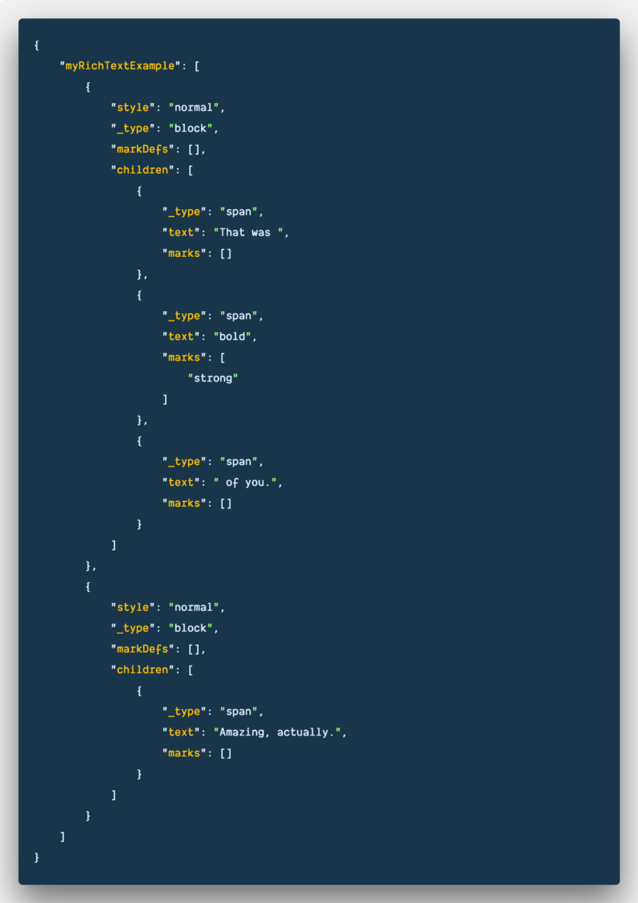
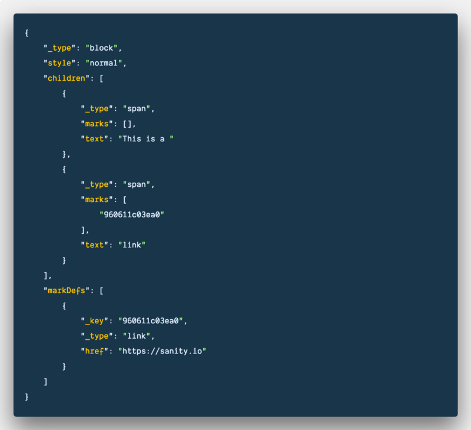
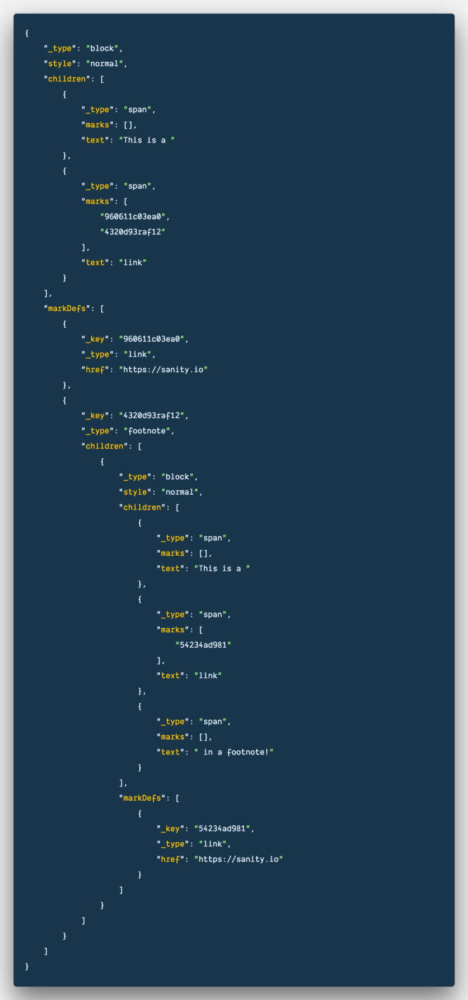

Let us get this out of the way first: At [sanity.io](https://sanity.io/freecodecamp?utm_source=freecodecamp&utm_medium=blog&utm_campaign=jq) we love HTML. We love Markdown. We use both every day for writing on the web. Even this text began its life in Markdown. And with this rather uncontroversial opening, you can probably see what’s coming. We will argue why you don’t want markdown nor HTML stored in your [CMS](https://hackernoon.com/tagged/cms), expect as code examples.

Almost everyone does it though, even the new kids on the block: We went through _all_ the vendors on [headlesscms.org](https://headlesscms.org/) and browsed through the documentation, and also signed up for those who didn’t mention it: With two exceptions they all stored rich text either as HTML or Markdown. Fine if all you do is use Jekyll to render a website, or if you enjoy using `dangerouslySetInnerHTML` in React.

But if you want to reuse your content in interfaces that aren’t of the web. Or if you want more control and functionality in your rich text editor. Or just want it to be easier to render your rich text in one of the popular frontend frameworks, and have your components take care of different parts of your rich text content, you’ll either have to find a smart way to parse that markdown or HTML into what you need, or, more conveniently, just have it stored more sensically in the first place.

This is why Sanity adopted the structured text model for how we stored rich text when we started development in 2015. And now other CMS vendors have started experimenting with it. We’re glad that this catches on. Structured text is good for everyone.

Let’s get down to business. How do “That was **bold** of you. Amazing actually” look in structured text? Well, like this:

“Sir, are you crazy?,” you might say. How is this array of complex objects better than a simple `That was **bold** of you. Amazing actually`? Structured text isn’t meant for humans to read, but for your software to process. If you do read it a bit more slowly, you can get a feeling for what this [structure](https://hackernoon.com/tagged/structure) allows you to do. Keys like `style`, `markDefs`, and `marks` let us describe text blocks and inline text in any way we want, for any context we want. This block of JSON can rather easily be serialized into clean text, [HTML](https://github.com/sanity-io/block-content-to-html) or even [Markdown](https://github.com/sanity-io/block-content-to-markdown/). Or if you going to write for voice interfaces, we could easily make an editor for [Speech Synthesis Markup Language](https://developers.google.com/actions/reference/ssml) (SSML).

The real power comes with what you can do with `markDefs` and `marks`. A mundane example is links:

But what if you wanted to print this, text, and have that link also be a footnote? Structured text to the rescue:

If you take some steps back and look at this object as a whole, you’ll see that the rich text pattern is recurring inside the mark for the footnote. It’s structured text all the way down! In other words, this approach opens up to a lot of possibilities for how and where you want to use your text content.

Want to A/B-test on a product term? Well, now you can by adding a mark for the term variation. Want to more easily write unit tests for components with user-generated rich text data? It’s a breeze with this pattern compared to parsing HTML, which can come with all kinds of surprises and invalid syntax. Want to tweak your own editorial comment system that totally makes sense only in your organization? Structured text lets you do that without having to invent new markup in an existing markup language.

Example of how structured text allows you to customize Sanity Studio’s editor to work for speech synthesis, used in services like [Google Assistant](https://assistant.google.com/). We spent but a morning making it.

Structured text is also a significant part of how it was possible for Sanity to have a real-time content API that gives our rich text editor Google Docs collaborative capabilities. It also gives us an easier way to [customize how text you paste from other sources](https://www.sanity.io/docs/new-block-editor-features), like a webpage or a Word document, should be structured. Perhaps you want to store code snippets in a custom code block, or have your links output as footnotes [because you use Sanity to make books](https://medium.com/buro-int/headless-cms-for-a-printed-pizza-book-54b39827e651).

Adopting structured text for your content management system isn’t giving up on HTML, it’s embracing the fact that you should be able to structure your content in a way that makes sense for your editors and organizational reality, and not by the many specifications that come with one of the many markup languages. Let us worry and help you with that part.

Get up and running and try out Sanity by running this command in your terminal:

npm i -g @sanity/cli && sanity init

Check out our structured text packages for [React](https://github.com/sanity-io/block-content-to-react), [HTML](https://github.com/sanity-io/block-content-to-html), [HyperScript](https://github.com/sanity-io/block-content-to-hyperscript) and [Markdown](https://github.com/sanity-io/block-content-to-markdown). We also have a package for [transforming HTML into structured text](https://github.com/sanity-io/sanity/blob/master/packages/%40sanity/block-tools/README.md).

_Originally published at_ [_sanity.io_](https://www.sanity.io/blog/why-structured-text-is-awesome-and-you-totally-want-it-in-your-cms)_._