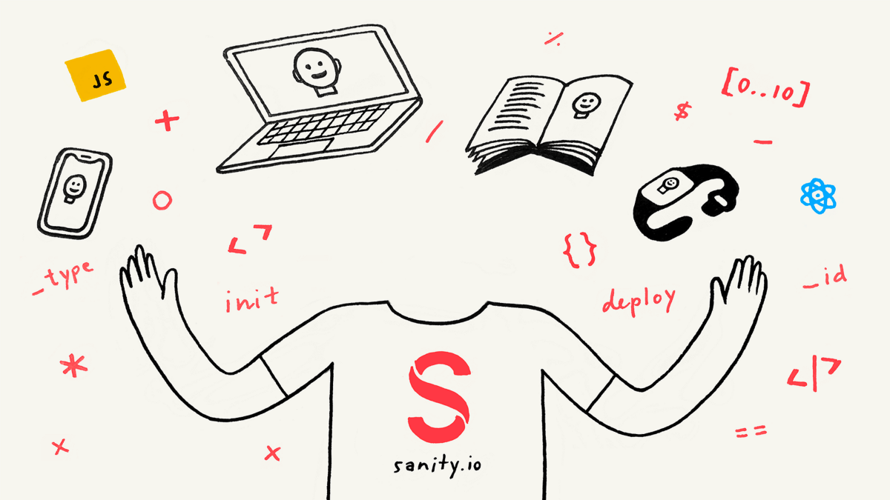

_Sanity is the perfect companion for when you want to get started with the JAMstack, or just need API for your project. In this tutorial you’ll learn how to get started with using Sanity — from configuring the_ [_React_](https://hackernoon.com/tagged/react) _editor with_ [_JavaScript_](https://hackernoon.com/tagged/javascript)_, to querying the API and migrating the content datasets._

If you find yourself in need of some backend, the chances are that Sanity is one of the quickest ways to get started without later punishing you. Spin up a new Sanity project for your weekend project. For that time you need an API to test something quickly. Or you can use it for more serious stuff. For example, when you need a conduit between a legacy system and the technology you prefer to use. And when you need humans to be in control of digital content, Sanity has an open source editor, that you can configure with simple JavaScript, customize with React, and host anywhere you want — be it on [Netlify](https://netify.com/), [Now](https://zeit.co/now), or on Sanity’s cloud.

It’s one of the best and well thought-through content backends I’ve worked with, and that’s why I now work for Sanity — and loving every single day of it.

_Watch the video “Getting Started with Sanity”_

You can create as many free Sanity projects you want and get a lot done within the developer tier, and the [pricing](https://www.sanity.io/pricing) is transparent and flexible.

You should be up and running within minutes — just use your Google- or GitHub-login, accept the [Terms of Service](https://www.sanity.io/legal/tos), and that’s it. Begin with installing the Sanity CLI and initiate a new project with:

`npm i -g @sanity/cli && sanity init`

The instructions of the `sanity init` command will take you through creating a project and downloading the Sanity Studio locally. If you run `sanity start` in your project folder, the CLI will open a local server with hot-module reloading so you can configure it without having to refresh the browser manually. The Studio is always connected to the hosted real-time backend, which means, that as soon as you begin working with content in it, that content will also be available and queryable in the API. In other words, it's swift to get a project going where your editor can begin working with content, that you can fetch and use in your project.

It can be useful to try some of the preconfigured templates the first time, but to show you how easy it is to configure the Studio [using schemas](https://www.sanity.io/docs/content-studio/the-schema), let me show you the code for a simple post entry with a title field:

```
export default {  name: 'post',  title: 'Post',  type: 'document',  fields: [    {      name: 'title',      title: 'Title',      type: 'string'    }  ]}
```

The Studio will now look like this:


If you don’t care about the Studio, that’s completely OK. You can just as easily use Sanity’s patch API to create documents and edit them. To make a queryable document, it just needs a [write token](https://www.sanity.io/docs/http-auth), a `_type` key, and there are some conventions for different data types that you'll learn pretty quickly. Using the [JavaScript client](https://www.sanity.io/docs/client-libraries/js-client), you can create a document like this:

```
import sanityClient from '@sanity/cli'const client = sanityClient({  projectId: '<projectId>',  dataset: '<datasetName>',  token: '<tokenWithWritePermissions>'})
```

```
client.create({ _type: "post", title: "Hello World" }).then(console.log)
```

```
> { _createdAt: '2018-11-10T20:06:56Z',_id: 'wK0NtpsoCZRvwU3EDtEub2',_rev: 'wK0NtpsoCZRvwU3EDtEuYI',_type: 'test',_updatedAt: '2018-11-10T20:06:56Z',title: 'hello world' }
```

And if you want to change (or add another) value:

```
client.patch('wK0NtpsoCZRvwU3EDtEub2').set({ title: 'Hello Worlds!'}).then(console.log)
```

```
> { _createdAt: '2018-11-10T20:06:56Z',_id: 'wK0NtpsoCZRvwU3EDtEub2',_rev: 'FUGFhuJJo756q4bO12e29f',_type: 'test',_updatedAt: '2018-11-10T20:10:31Z',title: 'Hello Worlds!' }
```

You can use Sanity CLI and create a new document with sanity documents create and write the data in your favorite text editor.

Example of ”_sanity documents create”_

### Querying data with GROQ

Now that you have a document you can query it with the API using GROQ (GRaph Oriented Query language). It is a declarative language designed to query collections of largely schema-less JSON documents. Its primary design goals are expressive filtering, joining of several documents into a single response, and shaping the response to fit the client application. To try it out, you can also do this right in the CLI when you are in a project folder, like this:

```
sanity documents query "*[_type == 'post']"
```

When you want to query content from your frontend, you can use one of the client libraries. There are libraries for [PHP](https://packagist.org/packages/sanity/sanity-php), [.NET](https://github.com/oslofjord/sanity-linq), and [JavaScript](https://www.npmjs.com/package/@sanity/client), with the latter one, you fetch documents like this:

```
client.fetch("*[_type == 'post']").then(documents => console.log(documents))
```

You can also type this into your browser and see the data there, or use anything that can send HTTPS requests: `https://<yourProjectId>.api.sanity.io/v1/data/query=*[_type == "post"]`

With GROQ you can also do something called [_projections_](https://www.sanity.io/docs/groq/groq-pipeline-components), where you have a lot of control over how your data is formatted. It’s used by inserting curly brackets `{}` after a filter, where you can select the fields you want inside them. For example, if we wanted to only include the \`title\` field for our posts, we could do this:

```
sanity documents query "*[_type == 'post']{_id, title}"
```

### Migrating your content is easy

The whole point of a hosted content backend is that it should be simple for you [to migrate, duplicate, and move your data](https://www.sanity.io/docs/migrating-data). Especially if you want to use it for something in production, you should have an easy way of duplicating that content into an environment where you can test and experiment. In Sanity, it’s straightforward to export all your content and assets in a neat [ndjson-file](http://ndjson.org/) (and a folder with all your assets), using the CLI:

```
sanity dataset export <datasetName>
```

And vice versa:

```
sanity dataset import datasetExport.ndjson
```

You can even get an instant ndjson dump of all your content using the export API (it’s 🚀 fast too!): `https://<yourProjectId>.api.sanity.io/v1/data/export/<datasetName>`

### Next steps…

You should now have a basic understanding of the stuff you can do with Sanity. There’s a lot more to discover, but the nice thing is that you can do it step by step as your needs and ambitions rise. You may want to learn more about how you can [completely tailor your studio for your clients need](https://www.sanity.io/docs/content-studio/structure-builder), or [take advantage of the rich image metadata](https://css-tricks.com/five-interesting-ways-to-use-sanity-io-for-image-art-direction/), or dive into some advanced [patching and mutation techniques](https://www.sanity.io/docs/http-api/http-patches). You can also check out the frontend example in [React Native](https://github.com/sanity-io/example-app-react-native), [Vue](https://github.com/sanity-io/example-frontend-vue-js), [Next.js](https://github.com/sanity-io/example-frontend-next-js), and [Nuxt](https://github.com/sanity-io/example-ecommerce-snipcart-vue).

Whatever you choose to use Sanity for, there is also a [community](https://slack.sanity.io/) that would love to hear about it and offers help if some roadblock comes in your way.

_Originally published at_ [_www.sanity.io_](https://www.sanity.io/blog/getting-started-with-sanity-as-a-headless-cms)_._