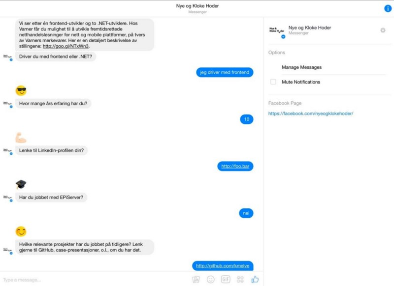

Mye tyder på at mennesket alltid har vært fasinert av det matrielles evne til å imitiere liv. Vi har en medfødt evne til å anta intensjonalitet og tankeevne ut fra bevegelsesmønstre og geometriske mønstre som passer malen for «noe som lever». I sin grunnleggende form er dette øglehjernen som antar intensjonalitet bak en høy plutselig lyd eller en levende form i tussmørke, men det er gjennom språket, det aurale og/eller visuelle vi kan oppleve de rike imitasjonene.

Såkalte _chatbots_, eller samtalerobotter, har på nytt blitt en snakkis. Tanken på å kunne ha en naturlig samtale med en maskin har nok vært med oss, i hvert fall siden den industrielle revolusjon hvor man lagde mekaniske botter, gjerne avgrenset til en spesifikk greie: sjakk, tegning, eller bueskyting. Med datamaskinen, og ikke minst, den personlige datamaskinen, fikk alle muligheten til å prøve seg. Vi har mange eksempler på tekst-baserte bots, som for eksempel [den som gjemmer seg i tekstbehandlingsverktøyet emacs](http://osxdaily.com/2010/01/23/use-your-mac-as-a-psychotherapist/). I 1997 ble [_Cleverbot_](http://cleverbot.com/) lansert på internett, og fikk dermed tilgang på tusenvis av samtalepartnere som den stadig lærer av.

Chatbots har alltid vært nærliggende fagfeltet som holder på med kunstig intelligens. Alan Turing, foreslo at et kriterie for å si om et dataprogram hadde intelligens, var at vi ikke kunne skille mellom hvem som var menneske og hvem som var datamaskin i en samtale. Dette er vanskelig og tidkrevende å få til om du kun bruker enkle algoritmer. Hovedgrunnen til at vi igjen snakker om dette, er utviklingen innen maskinlæring og _big data_. I dag satses det på nevrale nettverk hvor vi på ulike måter simulerer hvordan hjernen gjør kjapp mønster-gjenkjenning. Når vi har trent et nevralt nettverk men samtaledata innenfor et avgrenset domene (for eksempel kundeservice på IKEA), så kan vi programmere for _intensjonalitet_ i stedet for enkle nøkkelord eller fraser.

Det er jo ikke bare opplevelsen av å ha en samtalepartner som du vet er et dataprogram som er gøy med chatbots, men mulighetene for å få ting gjort og føle seg forstått i prosessen. I seg selv er de et ganske enkelt grensenitt, enten det er snakk tekst-dialog eller stemme-gjenkjenning/syntetisering. Det er kanskje det enkleste digitale grensnitt å gjøre universelt tilgjengelig. En chatbot kan kobles på der vi allerede prater sammen, enten det er på Slack, i Facebook eller via den stemmestyrte boten på mobiltelefonen vi har i lomma. En god chatbot kan ta i mot én setning i imperativ og bare gjøre greiene for deg. En bedre chatbot kan ta høyde for konteksten og minne deg på ting du glemte at du burde og ville gjøre (og gjøre det for deg etterpå).

Det skal på en annen side ikke så mye til før vi forstår at vi snakker med en maskin. Chatbots som ikke er flinke til å forstå intensjonalitet, eller kontekst introduserer ofte mer friksjon mellom det vi ønsker å gjøre, og det vi får gjort enn andre grensesnitt. Det holder dessuten ikke bare med et samtale-grensesnitt, det kan også være omfattende å programmere det som faktisk skal skje ut fra en interaksjon med en chatbot. Det krever ofte god treningsdata, og dersom brukerne dine ikke snakker engelsk, men norsk, så er det begrenset med skuldre å stå på. Og ikke minst, chatbots må naile stil og tone. Ingenting er verre enn når Siri prøver å være søt, når du er stressa eller frustrert.

Chatbots kan være ekstremt brukeroppgave-fokusert. De forutsetter at vi har kunnskap om brukerens intensjonalitet, noe vi i Netlife Research allerede prøver å måle i dag. Det er interessant å tenke seg at [Task Analytics](http://taskanalytics.com) om et og et halvt år, også kan være en chatbot. Hvor grafisk designere og frontendere gjerne ruler nettleseren, vil en chatbot putte innholdsfolk og interaksjonsdesignere i prosjektførersetet. Det er også noe bør brukertestes.

I Netlife Research har vi eksperimentert med chatbots i Slack. Vi har en som plukker opp fraser som «noen bør» og dytter det inn i en gjøreliste i Basecamp, og en annen som samler inn data om hva folk skal jobbe med fra uke til uke. Chatbots kan jo ofte være forkledde skjema, som f.eks her hvor _Nye og Kloke Hoder_ tok i mot en stillingsøknad over Facebook Messenger. Men de er enda mer interessante når de klarer å _gjøre_ noe og løse de brukeroppgavene som er relevante for den sammenhengen samtalen skjer i.

Chatbots er et brukergrensesnitt vi er nødt til å forholde oss til, og antagelivis, flere av oss vil bruke mer. Det er ikke lenge til vi vil komme over den rare sosiale kneika det er å prate med telefonen sin i det offentlige rom. De store teknologi-selskapene satser på chatbots og talestyrte grensesnitt, og da vil vi ikke være de som sitter på gjerdet.