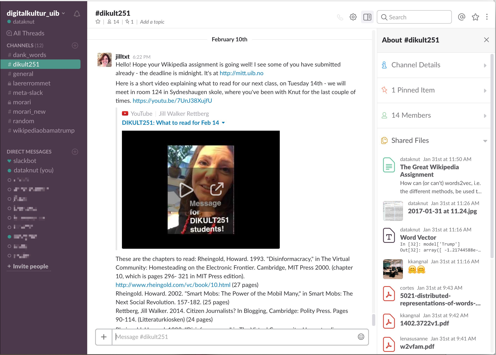
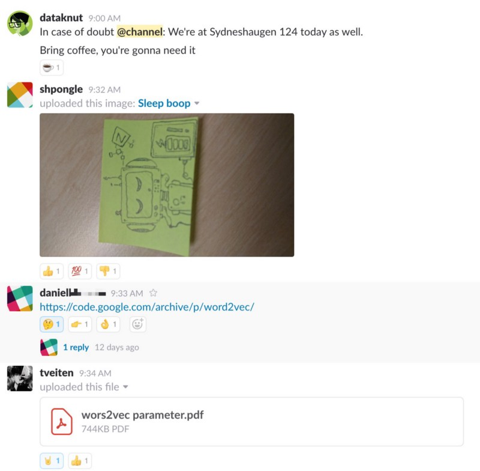
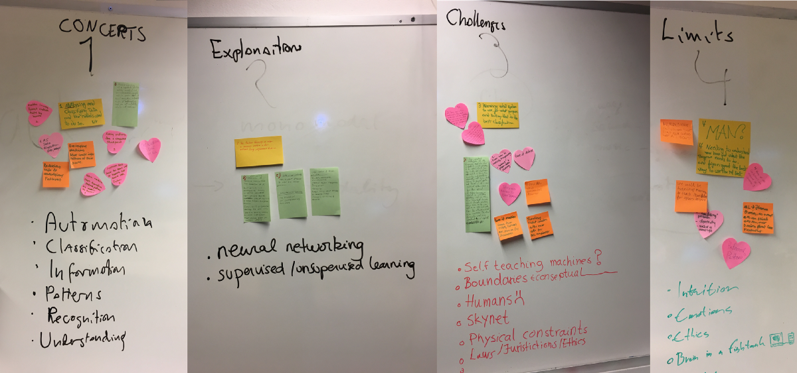
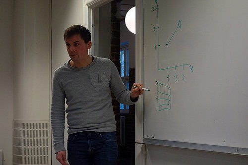
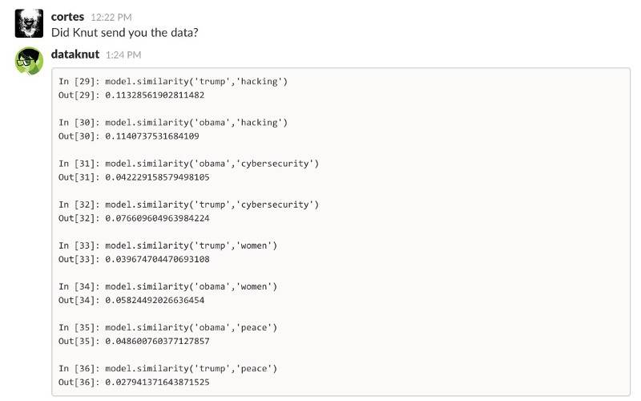

The Digital Culture at the University of Bergen Slack Team.

_tl;dr: If the headline doesn’t earn your attention for five minutes, you probably don’t need the synopsis._

Last fall I was asked by professor in digital culture [Jill Walker Rettberg](http://jilltxt.net)\* to teach two workshops in the undergraduate course [_Critical Perspectives on Technology and Society with Bachelor Thesis_](http://www.uib.no/en/course/DIKULT251)_._ I immediately said yes, because teaching and dissemination were my favourite activities at University. Even though my disciplinary background is within [the study of religion\\s](http://www.religiousstudiesproject.com/2013/12/06/what-is-the-study-of-religionsself-presentations-of-the-discipline-on-university-web-pages/#introduction), my Digital Humanities approach has brought me closer to this discipline as well. I’m sorry, you came for [Slack](https://slack.com) and Machine Learning.

I had two goals for these workshops:

1.  Try Slack as a tool for student-student and student-teacher interaction
2.  Teach students to teach themselves (and me) Machine Learning

#### How to teach with Slack in the age of distraction

I have 😍 Slack ever since I got hired as a coding interaction designer at [Netlife Research](https://www.netliferesearch.com). Every day it eliminates the need for email and meetings, and it enables casual interaction as well as fruitful discussions within and across disciplines. I’ll focus most on what worked in this post, but it should be noted that Slack has its challenges as well, and — in the spirit of this course–not just dive into it uncritically.

A sneak peak from the course Slack-channel.

The University of Bergen has just switched out their old homespun LMS for [Canvas](https://www.canvaslms.com). Even though Canvas is fine for what it is, it isn’t _fun_ or _inviting,_ nor is it really built for dynamic team work. Slack is.

I made a Slack team for digital culture at UiB, and invited the students to join with their university-email adresses. It took them less five minutes to get it (the magic on-boarding link is genius). Some of them were already familiar, some of them not. I gave a short introduction to channels, the command line and bots. Before I was finished the channel _#dank\_memes_ was already flooded with… dank memes. I guess this is what you call success?

#### **Close your laptops!**

Slack can be pretty immersive though, so if you plan to use it for course work, the platform demands that you help the students with their attention. This require you to be a bit mindful whilst teaching. I had some shorter sessions where I introduced some basic Machine Learning concepts and activities and had no chance competing with whatever happened on their screens. When I noticed what was happening I prompted the students to close their devices.

I prefer to use the whiteboard, some live code or whatever in the browser, instead of [prepared digital slides](https://medium.com/@kmelve/sliding-into-the-void-e3557ba87da6). This allows me to prepare in a more fruitful way and makes for a more dynamic presentation. I mostly manage with bullets points of talking points that address my teaching goals.

Since I’m now a creative digital consultant I also brought post-it™ notes for the students to use during the workshop. I firmly believe in the triangulation between analog and digital tools. Slack was great to disseminate the tasks and online resources they needed. In group-channels they could also share links, ideas and stuff they found. But the real though work was done in shorter sessions with note taking on post-its.

#### Teaching Machine Learning in the Humanities

Machine Learning has become one of those clickbaity (I hope) buzz words. It’s also endowed with a bit of techno-esotericism, because, I suspect, not many actually know how machine learning works. I can’t really say I know it either, even though I have “dabbled” a bit with it in my PhD work. It is, and will be, however hugely influential in the years to come, and it brings with it fascinating possibilities when it comes to research in the liberal arts and humanities as well. Therefore I found it important to at least be familiar with some of its core concepts, possibilities and challenges.

I picked a machine learning method called [_word2vec_](https://www.tensorflow.org/tutorials/word2vec/) and gave the students a selection of introductory blog posts about it. I asked them to work in groups and read through one of the posts and take notes on the post-its. I also gave them some reading questions in order to help them along. Afterwards I asked them to structure the notes under four headings, and afterwards some of the students had to lead the discussion and go through the notes in a plenary session.

Note to self: practice whiteboard hand writing.

My impression is that they pretty much got the basic concepts and managed to reflect critically on the implications and challenges with such technology. I like to think that machine learning is less mystical for them now, and that these session contributes to a more sober look at the possibilities of emerging technology. Of course, I photographed the white board afterwards and posted the images in Slack.

#### Honing in on word2vec

I started the second workshop with asking the students to find _academic articles published in a legitimate academic journal_ just from the keyword “word2vec_”_ and post the PDFs in the Slack-channel. This way we both got to practice academic source gathering and get some actual useful reading material that they could use later. We also had a minor chat about how Google Scholar worked and how they could use their library access to get to published research. We also learned that the _word2vec_ method is fairly new and that there hasn’t been much research done on/with it yet. It was a good warm-up to the introduction I did afterwards on the whiteboard.

Me explaining vectors in a warped grid. Happy accident? Photo: Elise Løvereide

The students all got a short course assignment to discuss how specifically _word2vec_ can be used to research Wikipedia. I introduced to them the different queries we could do, and offered to run them for them if they wanted to experiment or include some data in their discussion. Slack showed itself to be pretty practical here as well. It’s easier to just ping me on Slack with a fast and casual interaction, than to author an email to me (which I’d probably ignore anyway). I could post the data output in Slack.

I suspect that the results wasn’t as clear as they wanted. Probably because the Wikipedia dump was from 2015.

### Conclusion

I hope Jill will continue the Slack experiment throughout the course, and I’d love to try it myself with my own group of students. My first and shallow impression is that it may enable a good and relaxed group dynamic, if you actually make some effort to use it.

Slack also made it possible for me to post tips, interesting links, answer questions and so on during the working sessions, without having to grab the students’ attention. Albeit a bit daunting, it enabled quick switching between synchronous and asynchronous interaction when we were all present in the same room. I’d also explore how bots and third party add-ons could’ve enriched the learning experience, and especially how the students themselves would hack and make the space their own.

As for Machine Learning my fears that it was too difficult or boring were unnecessary. They perhaps would’ve been if I came with a slide deck and talked through the many mathematical formulas and conceptual models. Introducing the core concepts however, and, not at least, making the students do most of the work, was probably more engaging and useful for everyone involved.

What I’d do differently next time is to prepare the students a bit more before the workshops, perhaps with a video. I’d also try to have them either install word2vec themselves, or make an online service, in order to have them play with it themselves.

Have you considered Slack for coursework, or have any experiences with it? Please do tell in the comment section!

\* _It should be noted that Rettberg’s online presence was an important influence on me as a young student who spent most of his time in the digital world. Her blog was probably one of the first academic blogs I followed, and has paved a path for this blogging academic. At the time I found it cool and novel; now I almost find it obligatory. Times change._