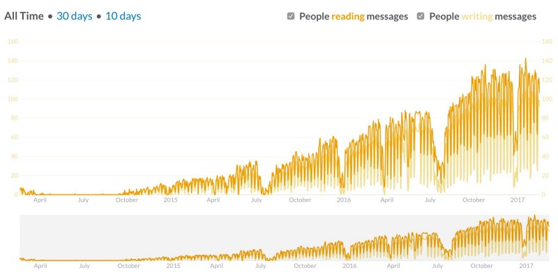

](img/1__1YnfT2g0XAprVtAcawFLaw.jpeg)
[Obligatory relevant XKCD comic](https://xkcd.com/1810/)

_Slack is used by Netlife Research as the primary platform of communication. We have used it almost exclusively for over a year now — though email occasionally happen. This is partly a summary documenting how, and partly a reflection of how we should continue use Slack._

#alle\_live-slacking is a place where consultants can share their everyday experiences across the company

When I was offered a job at [Netlife Research](https://www.netliferesearch.com) I was also added to its Slack-team. Three months before I officially started. I was included in a communicative _culture_, which enabled me and my team to get to know each other before I was a regular at the office. For me, Slack has been indispensable and a fun way to enter, consume and ultimately nudge company culture. I swiftly became Netlife Research’s internal Slack-evangelist, and eventually also got the responsibility for it. Hey, look at me.

I’m giving you this context because I want be upfront that I’m one of those (many, mind you) who have guzzled the Slack Kool-Aid. But that’s why I also want to use this opportunity to be a bit self-reflective and ask why and how Slack and internal communication should be used, in other words to foster a company culture for the people that constitute it.

Netlife Research made the move from SocialCast (a.k.a Facebook Workplace of the early 2010s) to using Slack exclusively come fall 2016. At that point, every person in the company was about to start using it as their _main_ communication platform (project management platforms such as Basecamp, Trello, Github, and so on, are still used in many projects). Important memos from the executive office are disseminated in Slack — it’s the place where we invite customers in private project channels—and present new employees to the company.

#### Stats

At Netlife Research we use Slack primarily for direct communication with peers and customers. 55 percent of the messages are DMs, a third of the conversation happens in private channels, and 14 percent in public channels. Since we also use Google Drive, we have “only” gathered 26k files worth 53 gigabytes. We have a total of 411 members, of whom 96 are full members. As of last month 111 are reported by Slack as “reading and writing”. If you look at the total messages read and written over time, the curve is steadly increasing.

We also take holidays.

#### Organization

The point of Slack is to have an infrastructure wherein people can take part in forming their own culture–that being said, some minor organization is necessary. We have five mandatory channels that everyone has to be member of: everyone, important, launched, sales and live\_slacking. The rest are optional. We have channels for the disciplines: UX, technology, design, content, project management and analytics. The rest of the channels span topics such as Internet of Things, Music, and — of course — #rant.

Private channels are mostly used for projects and clients. Projects often have a dedicated channel for clients and a separate internal one. This requires some discipline in order to not cross streams.

The channel for important messages has some special rules: people are discouraged from posting anything in it, unless it’s something relevant for everyone in the company. For example, you aren’t allowed to reply to posts and make threads. This has spurred some debate as some users want to have the possibility to ask questions or require clarifications in the context of the initial message. This is of course reasonable — that being said, we want to keep this stream as tidy as possible, so it’s easy to locate and get the messages.

Ideally I wanted everyone in the company to have administrator rights and the capability to invite external guests. After clients and external partners were accidentally invited as full team members (thanks to the iOS app) we had to change this practice. Now team leaders and a selected few have administrator rights, and invitations have to go through them. Some find this friction a bit annoying, especially if the admins don’t respond when they’re in a client meeting. Only me and the COO are allowed to invite full team members. Every employee, however, can set up integrations and bots as they please.

#### Bots and integrations

In spite of the hype, our Slack isn’t teeming with bots and integrations. The public channels are mostly clean of bots and have no external notifications. The only exception is a daily reminder to stand up for at least 30 minutes, and one every Friday to remind people to sign up for lunch for the coming week (we don’t know if these are effective though). In other channels we typically have Github, Twitter (in the communication channel), and AirTable. The latter can be quite useful.

In one of the team channels we have a bot that puts messages containing the phrase “someone should…” and inserts it into a Basecamp todo-list. We also made a bot that integrates with conference sites and notifies when someone has ordered a spot (it fuels team motivation). We have also experimented with IoT-integrations and stand-up, polling, coffemaker bots and a pizza box doorbell.

](img/1__H1jm6nbn6d46JnVw15eVow.jpeg)
A Slack Door Bell prototype in a pizza box. [Check it out here.](https://github.com/netliferesearch/netlife-ping)

### The need for conversational code of conduct

Slack and egalitarianism go hand in hand, but a community of many people still requires some social structure. I’ve been given the responsibility for keeping Slack useful for everybody, which means implementing some few rules, but mostly getting out of the way. Except for the few rules mentioned, we haven’t yet felt the need to formulate a code of conduct or any explicit moderation outside of calling out someone that perhaps went over the line (that very seldom happens, and was partly solved by giving them, i.e me, some responsibility).

Still, reflecting on our use, I have come down with some guiding principles that serve to make communication in Slack better for most, and prevents total and utter chaos. They are, of course, as much topics for discussion as anything else.

**_1.With great power comes great responsibility._**

From handing out administrator privileges to everyone who wants it, we have become somewhat restrictive with these. Mainly to have some control over the amount of multiple channel guests (which is a cost issue), but also to prevent external members in the internal channels. We have had some instances where external people were invited as full team members, because of the lack of granuality in the mobile app.

**_2\. Don’t just share links, comment on them_**

Sharing things in Slack can often be a knee-jerk-reaction to something you found somewhat interesting. We all do it, post a link in Slack without any comment. While sharing links, news and interesting things can be valuable in itself, the chance that it’s followed up is smaller compared to links posted with some pretence or comment. A link without context doesn’t contribute as much as a link with.

**_3\. Don’t be a clever-dick_ (🤔🍆)**

Sarcasm is definitely a survival strategy for most consultants, and Slack is a good place for it. However, sarcasm and tongue-in-cheekness don’t always communicate well when they’re directed towards colleagues. Even though you and your colleague may have a congenial, but rough tone, this isn’t always apparent to everyone else in the channel. When I was called out for being a clever-dick, I was first a bit hurt, but it also created this point of reference, where we tongue-in-cheek can call out someone being a bit on the edge of what is considered constructive. (And, there’s always #rant)

**_4\. Respect the Raccoon_**

We have adopted the [Slack’s :raccoon: strategy of redirecting](https://slackhq.com/slack-103-communication-and-culture-c129cd970e78#---0-11.v6xug4hwf) discussions to their respective channels. This is to reduce channel noise, but also for purposes of finding the discussion later. It can be useful to start the redirection with a link posted to OP message, to create a cross reference.

**_5\. The pusher’outer_**

This behaviour we see all the time. Someone has requested the channel’s attention with a question, but are pushed out by some other colleague’s posts. While some posts perhaps are genuinely uninteresting or don’t really warrant follow-up, you should at least consider if you can wait with your thing, or perhaps venture to answer the respective posts. With threading this has become somewhat easier.

**_6\. Channels with purpose_**

Every channel should have an explicit purpose. Don’t hesitate to archive channels that haven’t been used for a while, they can always be restored.

**_7\. Making space for enthusiasts and lurkers_**

Not everyone likes or wishes to make the time for online water cooler talk, or feels comfortable or confident discussing in digital space. Some enjoy just parsing through the stream made by others. This has for me been hard to accept, because I’m curious about the perspectives and opinions of all my colleagues. People take to these things differently though, so having an open environment means also accepting those who lurk (they may contribute to the discourse in other ways). On the other hand, be patient with enthusiasts and those who just can’t let something slide without comment.

**_8\. You should probably use threads_**

One of the main gripes from those in the company that prefered the FaceBook-like wall in Social Cast has been the historic lack of _threads_ in Slack. It not only made it easy to miss discussions and other things of interest, but also made it harder to get back to – because everything is in a single stream. Still, it seems that the company has become used to not having threads, and we don’t see a huge adoption of it (yet). It seems that it’s also hard to use consistently as people will answer in and outside of it, sometimes making parallell discussions. It also takes the discussion out of notification, having some people complain that they actually miss out on stuff that we’re interested in participating in, because they didn’t get any unread messages.

**_9\. In Direct Messages, just ask the question_**

Some people like to start new conversations with just a “Hi”, or “Are you there?”. While this impulse is perfectly understandable, because we are after all civilised human beings (or at least human beings), it bypasses the usefulness of asynchronous communication by being intrusive without actually revealing your intent. So just ask the question and let the recipient come back to you when s/he has the chance. (Sidebar: no one is obliged to respond immediately to a DM — and if you’re really worried about forgetting to reply, you can use the Remind Me Later function).

#### Scaling company culture

One of the main challenges of a growing company is the persistence and development of the company culture. As for the host for the everyday communication, Slack has for us become an essential tool. Therefore, it’s important to have a reflective and curious stance towards the constraints and possibilities to it. The main purpose of transcribing these reflections into a code of conduct would be to invite active discussion on how we use Slack. One of the most important insights I’ve had is that people generally don’t remember such rules, and it’s hard to enforce them in conversation without creating a feeling of being moderated. This in turn dampens the fun and casual atmosphere that Slack seems to lend our digital communication.