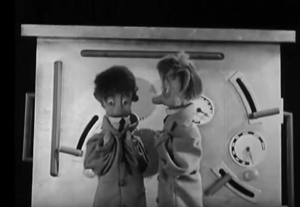

Omtrent sånn ser en kunstig intelligens ut dersom den kjøres igjennom en kvantedatamaskin. Den kan også plukke ut hva du skal ha til middag i morgen, eller gjøre mindfullnessen for deg.

#### _Måten vi diskuterer innovasjon og fremtiden på er på god vei til å bli en serie av buzzord, klisjeer, intetsigende krystallkule-visjoner om flygende biler som kjører seg selv. Nå er det på tide å ta det litt ned på bakken igjen._

En av mine kollegaer postet nylig en lenke til en video av Gerd Leonard som akkompagnert med bokstav-animasjonen legger ut om fremtiden™ og alt den vil bringe oss. I en strøm av buzzord de fleste av oss har lest og hørt minst tusen ganger før, presenteres en fremtid hvor alt er digitalisert, automatisert, optimalisert‚ og så videre og så videre. Det er som bransjen vår har blitt tatt over av en slags Vaktmester Gorgon 3.0 i en abstrakt og litt fryktsom verden hvor vi digitale reparatører går inn og ut av dører og i en slags skrekkblandet fascinasjon skravlende innholdsløst om det vi gjør.

Dette er som New Age, bare med pene fonter.

Videoen til Gerd Leonard irriterte meg, og jeg endte opp med å være litt unødvendig kvass i Slack-kanalen der den ble delt og gikk til steget å sammenligne den med diskursen vi ofte finner innen for New Age-inspirert nyreligiøsitet. Der finner vi også visjoner om teknologi som vil løse problemer for oss markedsført med esoteriske begreper de færreste av oss egentlig forstår og med sterke personligheter vi har lyst til å stole på. Jeg angret litt etterpå: Det er ikke noe galt med å la seg fascinere, undre og filosofere over hva framtida måtte bringe i lys av teknologiske utviklinger vi ser nå. Det er i og for seg ikke egentlig alt som er galt med New Age heller, selv om det har blitt en begrepsmessig snarvei til noe som er litt cheesy, svevende og virkelighetsfornektende. Litt som startup-scenen og de verste _digitale transformatørene_ er i ferd med å bli.

#### Kritiske stemmer = innovasjonsdrivere

Den samtalen denne videoen står for, trenger flere kritiske stemmer. Vi har heldigvis noen av dem allerede; et eksempel er [svaret som (min kreative leder) Anders Waage Nilsen skriver til NHOs Kirsten Skogen Lund](http://www.dn.no/etterBors/2017/02/23/1808/Teknologi/hilsen-fra-dystopia) hvor han fremhever viktigheten av de som faktisk jobber med å gjøre digitaliseringen brukervennlig i næringsnorge, og sist uke hos eks-rapperen og nå kommentatoren [Aslak Borgersrud](http://www.dagsavisen.no/enslask/de-som-parasitter-godt-i-det-1.938998) i Dagsavisen som retter sitt kritiske søkelys mot gründer- og søknads-skrivevirksomhetene. I en [kritisk kommentar i Dagens Næringsliv](http://www.dn.no/jobbledelse/2017/03/12/2050/Endelig-mandag/singularity-ideologien-verdens-redning-eller-heksebrygg-pa-hoyt-niva) tar Eva Grinde for seg [_Singularity University_](https://su.org), som med mine religionsviter-øyne er nesten umulig å skille fra mye av det vi finner reklamert for på Alternativmessa. Vi trenger noen som fyller mulighetsrom-pjattet med faktisk innhold og mening. Du sier «innovasjon», og jeg sier «og så?».

Det virker for meg som at begrepet innovasjon  brukes som et selvinnlysende ord for noe bra og ønsket, i hvert fall slik jeg leser det brukt i de utallige avisreportasjene om gründere og startup-scenen, eller i mange av jobb-søknadene vi får til byrået. Nyskaping høres umiddelbart bra ut, men ser man nærmere etter, så er det egentlig ingenting som forteller om dette nye vil være vakkert, godt eller rett. Det forteller oss like mye om deg som person at du er «interessert, driver med, eller opptatt av innovasjon» som at du «liker TV-serier fra HBO og har en blogg». For realiteten er, vi har mer enn nok utfordringer i å implementere og utvikle relativt gamle ideer og løsninger. Godt gammaldags digitalt håndverk med andre ord. Det finnes mye som går i kategorien ærlig og ettertraktet arbeid, uten at det trenger å betegnes som innovativt.

Etter en vellykket finansieringsrunde og en femdagers sprint på MESH er pmplplt.io endelig klar med MVPet sitt.

For selv om vi har blitt flinkere til å beregne –hold dere fast– usikkerheten i samvariasjonen mellom veldig mange variabler på en gang i veldig mye data veldig fort istrødd litt bayesiansk statistikk: Også kjent som «maskinlæring», «big data» og «kunstig intelligens»; så trengs det fremdeles folk som jobber nær og prøver å forstå hvordan folk i dag bruker og lar seg brukes av digitale tjenester i hverdagen. Du blir ikke innovativ fordi du knoter litt rundt med [TensorFlow](https://www.tensorflow.org) eller leser [theverge.com](https://theverge.com) hver dag. Innovasjon –om det er det du ønsker å drive med– kommer mest sannsynlig i kombinasjonen av å mestre et håndverk, av å kunne lære fra seg og tenke abstrakt over prosesser, eller sette deg inn i et nytt felt, forstå mekanismene i det, men samtidig ikke godta premissene for at det er sånn det skal være. Og så lage greien da.

For meg virker det som at vi fører en samtale om innovasjon som preges av teknologisk determinisme: Det er uungåelig at teknologien vil gå som vi tror den gjør og vi kan bare reagere på det. Det samme finner man i New Age, hvor lovnaden om et total transformasjon av menneskeheten, enten fra kunnskap gitt til oss fra Mestre, eller en intern opplysning, låner legitimitet til en alternativ livstil.

Det er vi som jobber med digital teknologi –enten det er i kode eller i strategi– som driver det fremover, innenfor en ramme av kulturelle, sosiale og økonomiske forutsetninger, men til syvende og sist: Vi er i en begrepsvirkelighet som vi kan velge å opprettholde, eller utfordre. Det siste er mye mer interessant enn det første.