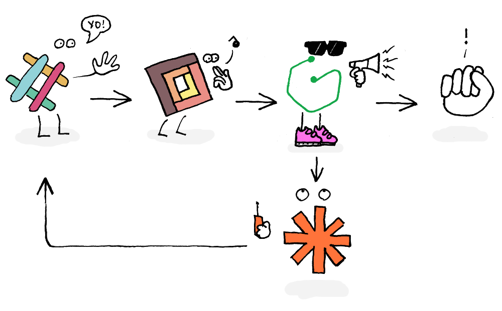
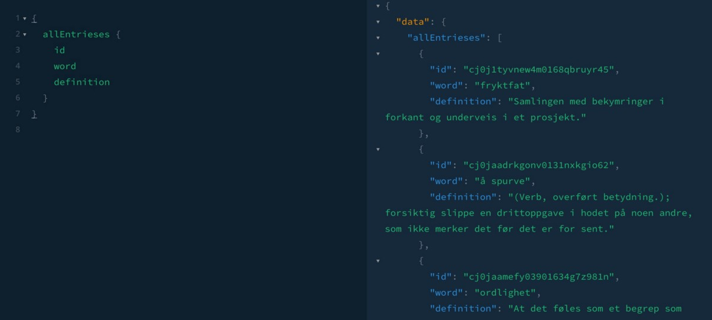

_tl;dr I’ve made a slack–webtask–graph.cool–website–zapier–slack webapp in a matter of hours, and it was pretty effortless and fun._

One of my colleagues recently posted a link to [graph.cool](https://www.graph.cool), which is a new “backend platform” built around the GraphQL query language. GraphQL is developed by the Facebook team and offers a very flexible way to interact with APIs, in that you can just ask for the stuff you need without being restricted to specific endpoints. In this way, the endpoint is created by your query and not the other way around.

Just ask for what you need, and you’ll get it neatly.

graph.cool makes it easy to set up a database-like backend scheme with columns, types and so on. I thought it would be a good excuse to start and learn GraphQL and advance my React-skills. But as always, it’s better to actually build something, rather than just do the “make an instagram clone” tutorial exercises. So I decided to initiate [www.stammesprak.no](https://www.stammesprak.no/), which is Norwegian for “tribal language” (i.e _jargon_) – here with the connotation of “💩 consultants say”.

stammesprak.no is a simple dictionary where we published words either invented where we work, or reappropriated and given a new meaning. Hence, the data model is really simple. It’s just two string columns named **word** and **definition** (in addition to the id and date fields required by graph.cool).

I populated the dictionary with words and definitions using the GUI interface at the website, and quickly had some sample data to build around. Thanks to the playgrounds section (see screenshot over) I quickly found out how to get the list of words, with definitions neatly formatted, into a data array. Graph.cool even gives you the code to put in your app.

The create-react-app portion of [this project](https://github.com/netliferesearch/stammespraak) isn’t really that interesting, but the data entry is. I wanted to make it easy for my colleagues in [Netlife Research](https://www.netliferesearch.com) to enter a new word and definition, but they were never going to log in to graph.cool to do that. Cool’s customer success person [Nilan Marktanner](https://twitter.com/_marktani) (who was super helpful 🙌) pointed me to [webtask.io](https://webtask.io) — a platform for serverless apps—where you can deploy a JavaScript function, and in return the service gives you an URL you can make a POST request.In other words, I could make a slash-command in Slack that, with an [Outgoing Webhook](https://api.slack.com/custom-integrations/outgoing-webhooks), makes a call to this URL with the entry data, and which webtask then in turn adds to the graph.cool database.

By using the [mutations callback](https://www.graph.cool/functions/) feature, graph.cool can also push data when something changes in the database. Ideally I’d make a webtask for this, but I took a shortcut and [send data to Zapier when a new entry is created](https://www.graph.cool/docs/tutorials/slack-notifications-with-mutation-callbacks-dah6aifoce/).

 and the Norwegian word for patience: tålmodighet)](img/1__dlYbM4M9Qlbv6lbOxFEhJw.jpeg)
**tormodighet**: when the project team acts like animals, but the project manager just gathers them without making a big deal out of it. (after the project manager [Tormod](https://www.netliferesearch.com/en/tormod) and the Norwegian word for patience: tålmodighet)

Going further, I want to make it possible to send edits from Slack, by resubmitting the word with a new or edited definition. Furthermore, the database should also have a column for url-friendly slugs, and because we’re a design firm, make it possible to add illustrations and internal links.

Taking a step back, it’s fantastic that without having to set up a server environment and advanced deployment routines, we’ve been able to build an interactive website with Slack-integrations in a matter of hours. Say what you will about JavaScript fatigue, but these services have made it pretty easy to get started building digital services in a creative way.

👉🏼 [Learn more about all the neat graph.cool stuff in their forums](https://graph.cool/forum)  
👉🏼 [Try out webtask.io](https://webtask.io)  
👉🏼 If you read Norwegian, [check out the website](https://www.stammesprak.no/)

_Also, thanks to_ [_Raymond Julin_](https://medium.com/u/59132ad25c1)_,_ [_Anders Olsen Sandvik_](https://medium.com/u/78aa3f4a5417) _and Mari Selnes for their help. And to_ [_Bård Hovde_](https://medium.com/u/25db4ee45a95) _for his awesome illustration._