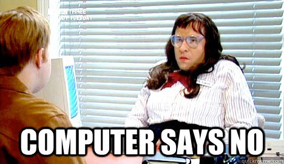

_– Fire ting vi kan lære om samtalegrenssnitt fra «Norges første personalsjef med kunstig intelligens»_

[**Denne teksten ble original publisert i Sysla Teknologi**](http://sysla.no/meninger/er-else-din-neste-personalsjef/)**.**

Oppblomstringen av samtalebotter –eller [_chatbots_](https://en.wikipedia.org/wiki/Chatbot) som de heter på engelsk — er kanskje det tydeligste eksempelet på hvordan servicenæringen automatiseres og hvor roboter tar over arbeidsoppgaver vi mennesker tradisjonelt har hatt. Bank- og finansnæringen investerer nå mye tid og ressurser til å utvikle automatisert kundeservice, samtidig som plattformer som Facebook, Apple og Google åpner sine samtalegrensesnitt for integrasjoner mot alt fra nettbutikker, medieleverandører til aktører i reiselivet. Det er liten tvil om at i nær fremtid vil vi i hverdagen både snakke og skrive til botter og mennesker om hverandre, og at førstnevnte vil kunne løse oppgaver for oss uten at vi trenger å anstrenge oss for å gjøre oss forstått.

Den nye personalsjef-boten [@else](https://else.sticos.no/om-else/) har de siste månedene dukket opp i Facebook-feeden min. Boten, hvis navn er en subtil referanse til en av de første samtalebaserte brukergrensesnittene [ELIZA,](https://en.wikipedia.org/wiki/ELIZA) lover å ta hånd om fravær, sykemeldinger og svare på spørsmål fra personalhåndboka. Av en eller annen grunn kan hun også klokka. I bytte mot e-post-adressen din, tilbyr Sticos [en prøverunde med «Norges første personalsjef med kunstig intelligens](https://else.sticos.no/prov-else/)» på nettsidene deres. Jeg benyttet muligheten.

En av de viktigste prinsippene i brukeropplevelsedesign for samtalegrensesnitt er å feile bra.

Ikke før jeg så skjermopptaket av samtalen min i etterkant la jeg merke til at den forhåndsutfylte teksten i tekstboksen var «@else fortell meg om…». Med markedsføringen og det samtalebaserte brukergrensesnittet forventet jeg at @else skulle forstå vanlige setninger. Jeg prøvde noen som jeg mer eller mindre ville spurt min egen personalsjef. Det er også litt uklart om demoen lar meg late som jeg er på jobb med @else. Det kan tyde på det, ettersom svaret «Det skjønte jeg ikke. Kan du være så snill å omformulere litt? Jeg er fortsatt under opplæring :)» kommer når @else ikke forstår spørsmålene mine. Her er også første lærdom om samtalebaserte grensesnitt.

#### 1\. Feil grasiøst

Dialog-design er mye brukt i dataspill.

Det er ganske vanskelig å lage et system som skal kunne ta imot alle de frasene vi bruker i hverdagen. Menneskeheten har jobbet med dette problemet i minst femti år, og selv [Siri](https://en.wikipedia.org/wiki/Siri), med et av verdens største og mest vellykkete selskaper i ryggen, sliter ofte med å forstå intensjonen bak det vi sier og _konteksten_ vi er i når vi snakker med henne. Det kan være vanskelig nok for oss mennesker, det.

De siste årene har vi likevel sett en del forbedringer i både datakraft og tilnærminger til denne utfordringen. I stedet for å lage store dialogtre hvor man prøver å ta høyde for mest mulig input, bruker man heller metoder for statistisk å generere algoritmer ut fra store tekstkorpus — såkalt maskinlæring. Apple har prøvd å abstrahere dette slik at programmerere kan integrere funksjonalitet mot _intensjon_ og ikke språklige fraser som sådan. Det betyr at en utvikler kan programmere noe mot «brukeren ønsker å bestille en vare» i stedet for å måtte gjette alle fraser og nøkkelord som måtte peke mot dette. Dessverre er ikke @else helt der hvor hen forstår intensjon i dagligdags språk. Selv på forholdsvis enkle spørsmål feiler HR-botten. Hvor Siri faller tilbake på et internettsøk, beklager @else seg med at hen er ny i jobben. Det er ikke en egenskap vi trenger å automatisere.

#### 2\. Design for forventninger

Mange synes samtalebotter er spennende fordi det på overflaten virker mye enklere å skape en mer involverende og organisk brukeropplevelse. Sannheten er at det er like enkelt å skape en dårlig opplevelse dersom man ikke også prøver å opprettholde illusjonen om at det ikke er en datamaskin man snakker med. På den andre siden er det også sånn at et menneskelignende grensesnitt også skaper forventninger som gjerne ligger utenfor det dataprogrammet kan levere.

Jeg får av og til følelsen av at @else er denne karakteren fra Little Britain

Jeg forventet egentlig å kunne spørre @else vanlige HR-relaterte spørsmål, men fikk kun i få tilfeller svar som var relevante. Og veldig få som egentlig var i nærheten i å løse brukeroppgaven min. Når @else ikke forstår meldingen min ber hen også meg om å omformulere, men gir meg ingen hint hvordan jeg hjelpe den å lykkes. Fordelen med å automatisere HR-oppgaver er at man kan sørge for å alltid ha en hjelpsom og service-innstilt medarbeider som vil gjøre alt hen kan for å imøtekomme behovet ditt. Foreløpig lar @else det være opp til deg å gjette hva som er de rette knappene å trykke på.

#### 3\. Botter må også ha personlighet

I Westworld legges det mest vekt på bottenes personlighet

Noe av det vanskeligste med å designe en samtalebot er å gi dem personlighet. Den bør ikke komme i veien for de oppgavene boten faktisk skal hjelpe deg med, men samtidig ikke så fraværende at du like gjerne kunne brukt et vanlig skjema. For å designe personlighet er man nødt til å være veldig bevisst de forskjellige kontekstene som brukerne befinner seg i.

Om @else skal ta over som personalsjef må hen være hyggelig og tillitsvekkende i situasjoner hvor folk er syke, usikre eller stressa. Samtidig må hen ha et snev med autoritet og entydighet når det er snakk om reglement og prosedyrer. Så langt fremstår @else som en litt ubehjelpelig søkeboks som unnskylder seg for hen ikke kan særlig mye ennå. Når @else skjønner tematikken i spørsmålet får vi en vegg av tekst som tatt ut fra intranett — som er nesten som å bli overrakt et regelhefte uten øvrig kommentar fra sjefen.

Veldig saklig, men veldig upersonlig.

#### 4\. Flere spesialiserte botter kan være bedre enn en veldig generell

Det er veldig åpenbart at @else fremdeles er i beta (eller trainee som hen selv kaller seg), men også at Sticos definitivt beveger seg inn på et interessant felt. Jeg mistenker at det denne demoen egentlig dreier seg om, er ikke å selge meg @else, men å samle inn spørsmålsformuleringer og data om sånne som meg som er interesserte i å teste ut slike botter. I svarene til @else er det også mulig å gradere det som nyttig eller unyttig.

Utfordringen er at markedsføringen som personalsjef skaper en del forventninger som dekker et ganske bredt spekter av arbeidsoppgaver. Det spørs om det ikke hadde vært enklere både å implementere, lære og designe en personalavdeling med ulike botter for forskjellige problemområder (tenk @lønningssbot, @reiseregningsbot, @sykemeldingsbot, @møteromsbot eller @kaffitrakterbot). Det er sannsynlig at i dette er i praksis arkitekturen bak @else, men jeg tror også det gjør det enklere å designe brukeropplevelsen for de forskjellige situasjonene som arbeidstaker-brukeren befinner seg i.

### @else er en antiklimaktisk demo, men som vekker fantasien

Jeg ble egentlig ganske skuffet av @else på dette stadiet opp mot de forventningene markedsføringen la opp til. Det er enkelt å se potensialet, og jeg aner at dersom Sticos klarer å dra nytte av mange av de utviklingene som har kommet med maskinlæring de siste årene, så er det ikke fryktelig lenge til at @else kan gjøre en smule mer nytte for seg. Det er også rart at vi ikke kan prøve @else i Facebook eller Slack, hvor Sticos også kunne hentet mye mer informasjon om potensielle kunder og interessenter. For en leder kan mellomlaget @else lager på en side avlaste og forenkle arbeidshverdagen, og om hen i kraft av sin robot-natur faktisk senker terskelen for spørsmål og henvendelser, kan datainnsamlingen også være verdifull. Vi kan for eksempel se for oss at en leder kan spørre @else om hvor mange som spør om lønnsbetingelsene, eller få en rask oppsummering av når på året flest pleier å spørre om sykefravær.

Det er ikke nok med nye flotte (meta-)algoritmer for å lese ut alt fra intensjon til humør i dagligspråk, demoen av @else viser også hvor viktig det er å legge til grunn god brukerinnsikt, innholdsarbeid og en inngående forståelse om hvordan folk interagerer i det daglige i produktutviklingen. Det er først den dagen @else er troverdig nok til å kunne gi noen sparken, jeg tror Sticos virkelig har kommet i mål med personalsjefroboten sin.