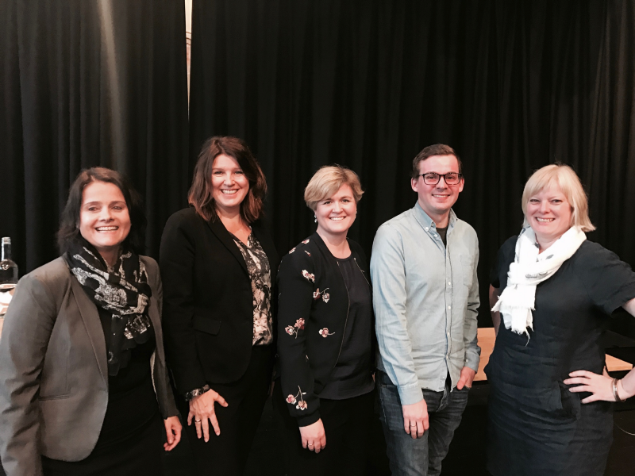

_Hva skal til for en fra humaniora å få jobb i næringslivet?_

Akademikerne og Samfunnsviterne inviterte meg nylig til å holde en innledning på frokostmøtet [_De skjulte ressursene — humanistenes bidrag til innovasjon og verdiskaping_](http://akademikerne.no/no/kurs_og_konferanser/frokostseminar_-_de_skjulte_ressursene_-_humanistenes_bidrag_til_innovasjon_og_verdiskaping/Frokostseminar+-+De+skjulte+ressursene+-+humanistenes+bidrag+til+innovasjon+og+verdiskaping.b7C_wRnSXh.ips). I invitasjonen ble jeg bedt om å reflektere over utfordringene jeg som humanist har hatt både i inngangen til og i arbeidet i næringslivet. Omtrent samtidig [endte jeg opp med å svare](http://www.bt.no/btmeninger/debatt/Humaniora-forblir-forst-og-fremst-viktigst-for-seg-selv-333801b.html) avtroppende HF-dekan, og påtroppende prorektor ved UiB, Maragreth Hagens kronikk om humaniora og næringslivet i [Bergens Tidende](http://www.bt.no/btmeninger/debatt/Kulturarv-og-historie-er-ogsa-viktig-for-naringslivet-333388b.html). Lettere solbrent etter en uke i Berlin, møtte jeg opp på Sentralen og [holdt et innlegg](https://www.facebook.com/Akademikerne/posts/1441926122536555).

Husk solfaktor folkens. Foto: Akademikerne

### Hvordan få jobb i næringslivet

Mye har blitt sagt og ment om humaniora i opptakten til og kjølvannet av Humaniorameldingen. I spørsmålet om humanioras samfunnsrelevans har det flere ganger blitt påpekt at humanistiske fagperspektiv hører hjemme også i forskningsprosjekt som vi vanligvis tenker på som naturvitenskapelige. Det har også blitt ment at næringslivet trenger humanister, gjerne i lys av digitaliseringen og et arbeidsliv som vil gå gjennom større endringer i årene som kommer. Humaniora fremstilles nesten som en hemmelig frukt som næringslivets ledere må overbevises og opplyses om å finne og spise av. Det er fristende å konkludere at grunnen til at ikke flere fra humaniora ender opp med å jobbe i det private næringslivet er fordi kunnskapen om humaniora er fraværende.

På den andre siden: Humanister _er_ jo ivrige formidlere, og de fleste i Norge skylder sin skolegang og utdannelse til tre håndfuller humanister som har valgt å bli lektorer og lærere. De fleste i næringslivet jeg har møtt, fatter ganske stor interesse for humanistiske kunnskapsdomener, og flere av dem er «til og med» i stand til å se hvordan humanistiske tilnærminger og perspektiver er relevant for virksomheten de er i. Samtidig så er måten å få innpass i næringslivet enten å ikke havne i den utsorterte søknadsbunken, eller å ha et nettverk som gir innpass ved navn og ry. Her kommer gjerne humanisten til kort på grunn av feil tittel og lite overlapp med slike nettverk.

Min magefølelse basert på en del år i universitetspolitikken, som relativt aktiv humanioradebattant og en forskerspire som tok sidesteget inn i privat sektor, er at utfordringene også er å finne innenfor de fire veggene til de humanistiske fakultetene (noen mer enn andre). Av og til tenker jeg at humanioraskrytet vi trykker i avisene, er mest rettet mot oss selv. For blant studenter, stipendiater, men også førsteamanuensiser og professorer, så lusker den pessimistiske fortellingen om humanioras sakte forfall. Og hvorenn mange strå av sannhet vi kan finne i den, så setter den oss ikke i en bedre posisjon. Er det noe vi humanister burde vite, så er det å se gjennom skjulte maktstrukturer i språk og fortellinger—også våre egne.

Her kommer derfor noen velmente råd til deg som sitter dypt i historiske kilder, pugger gramatiske mønstre i fransk, transkriberer dybdeintervju eller analyserer kunst fra 1830-tallet. De reflekterer samtidig hvor mye det er opp til deg å tråkke opp den mentale stien du er nødt til å gå etter endte studier – og det hadde jo ikke trengt å være sånn?

### 1\. Lær deg å jobbe, og lær deg å ta fri

Humanistisk utdanning er stort sett teoretisk og kildenær. Tar du studiene dine på alvor så er det faktisk ganske mye jobb. Går du videre i forskerutdanning er det såpass mye jobb at de fleste vil fortelle deg at den 37,5 timers uka du får betalt for, ikke kommer til å være nok. Samtidig, vi sitter kvelder, helger og ferier med arbeidet, ikke kun på grunn av selvpålagt dårlig samvittighet, men også fordi vi finner arbeidet givende, interessant og meningsfult. Som humanist kan du utvikle god utholdenhet med intellektuelt arbeid. Samtidig er du også nødt til å forberede deg på at du ikke kan påkoste deg like mye tid med en oppgave i det private næringslivet.

Derfor er det lurt å tidlig, og innimellom (eller ved siden av) studiene, prøve deg som freelancer eller ta oppdrag hvor du får erfaring av å måtte analysere og formidle med kortere og strammere rammer. Ta en titt på humaniora-bedrifter som for eksempel [Mannheimer](http://www.mannheimer.no) og se hva de gjør.

Du må også lære _å ta deg fri_, fordi hjernen din trenger hvile for å kunne være kreativ og skarp. Dette var kanskje den største utfordringen min, ikke minst fordi du i næringslivet gjerne får respons og uttelling for innsatsen mye raskere (og oftere) enn i akademia.

At du er en intellektuell sprinter som gjerne ikke trenger å kladde tekster eller lese noe to ganger for å forstå hovedpoenget er en vannvittig styrke, men du trenger også lære deg jobb-liv balansen for å ikke brenne deg ut.

### 2\. Ikke sats alt på én hest, sats litt på en trojansk hest også

Fra _Histoire des jouets_

Jeg tror mange som velger humanistiske utdannelser går inn i det med den interesse og forkjærlighet for _stoffet_ de studerer. Studieprogram og lignende er gjerne lagt opp for at man skal akademisk følge en faglig retning og ende opp som forsker. Det kan være fristende å gå denne trygge og forutsigbare veien, men i realiteten kan du ha mye igjen for å bruke frie studiepoeng eller et ekstra år langt utenfor din faglige komfortsone. Bruk gjerne den tiden på å skaffe deg et relevant bein å stå på.

For humanister er digital- og teknologisk kompetanse en no-brainer. Kan du lære deg koding, statistikk, data-analyse, interaksjonsdesign eller å bruke prototype-verktøy vil du få en profil som stikker seg litt ut, men gjør det også enklere for en arbeidsgiver å se for seg hva du faktisk kan gjøre den dagen du begynner på jobb. Diskursen i næringslivet i Norge handler nå om digitalisering og endring–gjør noe som skriver deg inn som en nyttig helt i det narrativet.

### 3\. Vær ambisøs og interessert

I mine år på Humanistisk fakultet har det hvilt et slags mindreverdighetskompleks som spesielt kommer til uttrykk under lunsjene til stipendiatene eller på fagfester med studentene. Man spøker gjerne om den realiteten som noen havner i: At man må på NAV etter innlevert oppgave, eller i påvente av svar på den midlertidige stillingen man har søkt på. Eller det smule klassistiske «at man nok får jobb i kassa på butikken» (til opplysning: Jeg jobbet 9 måneder på Rema1000-lager etter mastergraden, det var utrolig deilig og lærerikt). Det virker også at det blant noen studenter er kult å «ikke gjøre så mye, men allikevel få resultater».

Det var utrolig deilig å jobbe med noe konkret og avgrenset en stund etter mastergrad. Truck-sertifikatet fikk jeg også.

Det er kanskje ikke så vanskelig å få gode karakterer i noen emner, men det betyr ikke at du har gitt deg selv de mulighetene du trenger for å oppnå en meningsfyll jobb der du får deg selv på en god måte. Det skal være lov å sikte høyt.

Samtidig er det viktig å lære seg å bli interessert i noe utover seg selv. De fleste studenter jeg har møtt har stort sett bare akseptert hvordan faget er lagt opp, eller premissene som er gitt ved studiestedet. Jeg sier ikke at du bør bli studentpolitiker, men en som bryr seg nok om de faglige omgivelsene sine at man gir lærere og administrasjonen tilbakemeldinger på det som kunne vært bedre. Det er ikke så mye konkurranse om verv i akademia, det er lett å komme i en posisjon der du i minste er tilstede når det tas avgjørelser som vil påvirke studie- eller forskningshverdagen. Som student har du, selv om du kanskje ikke vet det selv, antagelivis også et frikort til å stille alle de dumme spørsmålene, og etterhvert få en teft for organisasjons(dys)funksjonalitet. Noe som vil komme godt med senere.

### 4\. Ikke finn deg i ting, men vær informert

Det er en vannvittig kamp om oppmerksomheten og tiden i akademia. Det faller ofte på enkeltpersoners velvilje og engasjement hvorvidt undervisningsopplegget ditt er bra, eller om du i løpet av studie blir oppfordret til å bruke kompetansen din praktisk. Det finnes mange gode folk™ i både faggrupper og administrasjonen ved De humanistiske fakultetene. Det er ofte de som svarer hyggelig på epost, eller ringer deg. Finn sånne folk og sett deg inn i hvordan systemet virker. Når du gir tilbakemelding, gjør det gjerne med forslag på hvordan noe burde vært gjort annerledes eller bedre.

For det finnes mange ting som ikke funker så bra i akademia og humaniora. Langdryge og slitsomme ansettelses- og søknadsprosesser. Interne konflikter og dårligere ledere. Et universitetsdemokrati som mange sier er viktig, men som få vil stille seg bak i form av verv og valg. Det er enkelt nok å syte over tilstanden, men det å sette seg inn i hvordan en såpass flokete organisasjon som universitetet fungerer vil gi deg ganske bra fingerspitzgefühl for det veldig mye enklere næringslivet. Tren deg i å følge kritikk med løsningsforslag; folk i næringslivet digger det.

### 5\. Gjør som George Constanza: Møt opp og begynn i jobben du vil ha

«I want you to have this job, of course…»

I en episode av Seinfeld blir jobbintervjuet til George Costanza avbrutt mitt i en setning og lar det være uklart hvorvidt han fikk jobben eller ikke. I god gammaldags Seinfelds ånd kan han heller ikke spørre fordi han «er jo en som bare forstår ting». Litt sånn er humanister også. George bestemmer seg for å bare møte opp neste dag og innta stillingen. Og her slutter forøvrig sammenligningen.

Næringslivet er ikke så modent ennå at det er normalt å tenke litt utenfor den vanlige CV- og tittel-boksen. Det er ikke sikkert vi humanister egentlig er så flinke til å snakke konkret om hvordan vi egentlig kan brukes og hva som egentlig er «verdiforslaget» utover «en som er flink med tekst og tenke kritisk».

Samtidig, norsk næringsliv blir i dag utsatt for et dramatisk og livsbejagene narrativ som lover tradisjonelle bedriftsmodellers død, disrupsjon og innovasjon som skal gi oss billigere energi, smartere hverdagsliv og kanskje til og med et lengre liv. Det er veldig mye snakk om behovet for innovasjon, men kansje ikke så mye snakk om hva vi behøver å innovere. Det er heller ikke mye snakk om _forutsetningene_ for innovasjon utover å tilgjengeliggjøre tid, penger og enkle modeller til folk som identifiserer seg med gründerlivet. Det er her du kommer inn. Fordi du er vant til å være en sånn litt vanskelig person som ikke tar premissene for gitt, etter du har klart å dekode hva som egentlig er de premissene som ingen direkte snakker om, men som tas for gitt i måten en bedrift snakker om seg selv på.

Men for å komme i den posisjonen hvor du kan vise hvorfor man trenger noen som raskt forstår «greia» uten å nødvendigvis måtte være spesialisert i «greiene», må du nesten møte opp, og møte opp forberedt. Sett deg inn i hva bedriften gjør, fortell dem at du kan hjelpe dem med de tingene ingen liker å gjøre: skrive tekster, rapporter, lage presentasjonsmaler eller lignende. Prøv å forstå narrativene de omgir seg med, og _vis dem_ hvordan du passer inn i denne fortellingen til deres favør. Det er antagelivis få som bryr seg om det du skrev masteravhandlingen din om, men det er antaglivis mange som er veldig interessert i den kompetansen som du måtte ha for å skrive den, og den du har utviklet med å ha skrevet den.

#### Myten om den humanistiske potet

Selv om jeg har tro på disse rådene som en bedre strategi enn å stålsette seg på NAV eller «bare ta et år med norsk for å bli lektor», så er jeg ikke så skråsikker som mange humaniora-forkjempere tilsynelatende er. Det er tilsynelatende fortsatt ganske vanskelig å lande en karriere utenfor det åpenbare. Og, ikke minst, det krever veldig mye av deg som søker. Det er et tankekors i lys av humaniorameldingen som nettopp ble laget, og alt det humanistiske selvskrytet i kjølvannet av den. Det er kanskje på tide at forskere, veiledere og studiestedene tar et større ansvar i å bygge broene som skal til for å introdusere flere humanister i flere sektorer i landet. Mange frykter at det skal gå på bekostning av den frie forskningen, men det er en undervurdering av vår egen posisjon i det maktforholdet.

De som sitter på forståelsen av hvordan man skal forstå menneskelig meningsdanning og språk, sitter på en kompetanse som er i ferd med å bli viktig på en annen måte en før. Og selv om maskinene har begynt å kunne lære seg språkene våre, så er de et stykke fra å vite om språket skjuler maktstrukturer, om flertydigheten som kontekster gir, og om noe er godt, sant eller vakkert. Tre livsviktige ideer du ikke nødvendigvis finner i en stillingsannonse.