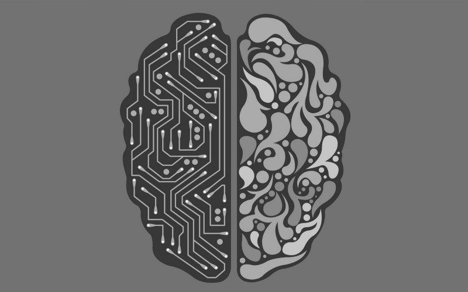
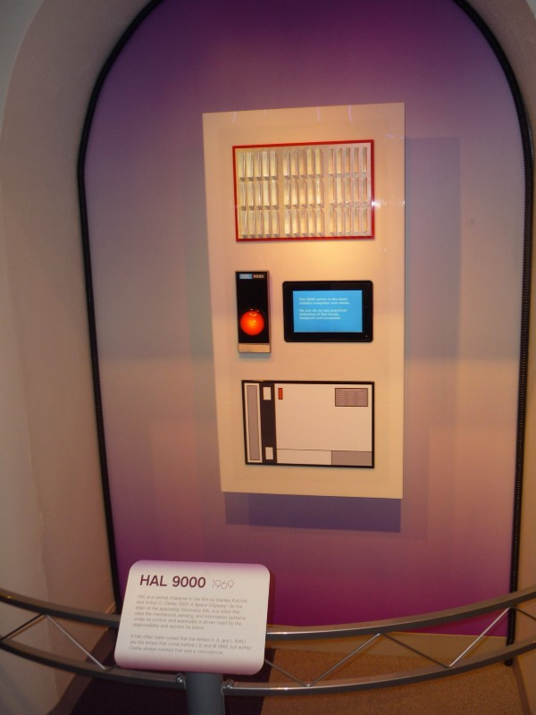

Robotene kommer! Arbeidsplassen din vil bli automatisert. Om et par år er det ingen som kjører selv lengre. Kampen om algoritmene vil føre til tredje verdenskrig. Datamaskiner vil oppdage sykdommer lenge før fastlegen din. Inn fra venstre kommer det språkteknologi som vil snu opp ned på språkforskningen. Menneskeheten er i ferd med å skape en intelligens større enn seg selv. Med de siste utviklingene innenfor kunstig intelligens står vi nå i et uavklart sted mellom utopi og dystopi. Vil utviklingen føre til vår undergang eller vår frelse?

#### Påfuglens vifting

Det er i hvert fall ikke rart at det snakkes mye om maskinlæring og kunstig intelligens i mediene for tiden. De som følger med i dingseverdenen har trolig også fått med seg et at teknologigigantene ikke nøler med å bruke dette i markedsføringen av sine produkter. Det å hevde at man mestrer og kan bruke maskinlæring er nå markedets svar på påfuglens vifting med en alt for stor halestjert. Til tross for at teknologien, maskinvaren og datastrømmene aldri har vært mer tilgjengelige, så er maskinlæring vanskelig i praksis. Hovedsakelig fordi man trenger menneskelig hjernekraft for å lære maskinene til å lære som mennesker. Men investorene flokker seg rundt allikevel — og man kan spørre seg om troen fremdeles er mer drivende i markedet enn fornuften.

Grunnen er nok at det er få som tar seg bryet med å forklare hva maskinlæring egentlig er for noe. Jeg prøvde meg på det tidligere i vår i to seminarer jeg holdt for studenter i Digital kultur ved Det humanistiske Fakultet på UiB. Ideene bak maskinlæring — som tross alt også er et bredt felt — er ganske overkommelige om man tar vekk den tekniske sjargongen.

Det ble også klart for oss hvor lett det er å ta maskinlæringens frukter for gitt, og hvor viktig det er at vi også lærer oss å tenke kritisk på områder hvor det er lett å la seg rive med.

På post-it lappene vi brukte i undervisningen hadde studentene skrevet ord som «intuisjon», «objektivitet», «følelser», «etikk», «juss» og «singulariteten». Bak matematikken som kraftige maskiner bruker på masse data, ligger det vanskelige spørsmål som har vært med menneskeheten fra vi selv fikk tankekraft nok til å tenke i bilder og symboler.

#### Turgåer i data-landskap

Men grunnprinsippene er likevel enkle: Målet er å finne en slags oppskrift som kan brukes for å kategorisere noe fra noe annet — helst uten at vi trenger å fortelle dataprogrammet så mye om hvordan den skal gjøre det selv. Det er en del forskjellige innfallsvinkler til hvordan vi gjør dette i praksis, men de innebærer stort sett at datamaskiner regner seg frem til veldig mange sannsynligheter, mellom veldig mange variabler, på veldig mye data, for å så trekke dette sammen i en modell som vi kan bruke videre.

Vi kan tenke oss dataprogrammet som en turgåer i et stort kupert data-landskap som forandrer seg litt hele tiden. Turgåeren går ned over dalen litt på måfå, og prøver å ikke sette seg fast i busker eller søkk. Vi kan be vandreren å ta med seg noen erfaringer fra tidligere turer, eller konkurrere med en annen turgåer. Vi kan også plassere noen varder i landskapet som hjelper turgåeren litt på vei.

Det som gjør maskinlæring rart, er at vi sliter med å forklare hvordan turgåeren har tenkt på veien, og hvorfor hen alltid kommer frem til den avtalte møteplassen. Vi vet at det antageligvis er noe mer enn flaks.

Hver uke blir det publisert nye akademiske artikler fra de som jobber med dette hos teknologigigantene, hvor man har gjort nye oppdagelser, men samtidig påpeker hvor dårlig det er forstått.

#### En del av hverdagen

Denne uvissheten gir også feltet en mystisk aura. Løftet om kunstig intelligens — som i dag tillegges maskinlæring — ligger tett opp til ideer vi har utforsket i science fiction og populærkulturen, siden før den kunstige intelligensen HAL9000 i Stanley Kubrick og Arthur C. Clarkes _2001 A Space Odyssey_. Slik kunstig intelligens blir ofte fremstilt som allvitende gudelignende vesen med intensjoner og hensikter utenfor vår kontroll. Det er fristende å bruke det latinske religionsvitenskapelige uttrykket «[_mysterium tremendum et fascinans_](http://referenceworks.brillonline.com/entries/religion-past-and-present/mysterium-tremendum-et-fascinans-SIM_14662)_»_; opplevelsen av noe vi ikke helt forstår og finner både attraktivt og skummelt.

Og samtidig er maskinlæring en del av hverdagen vår. Vi har allerede hatt maskinlærings-boter som har handlet på aksjemarkedet i over ti år, og det er få som hever et øyebryn når bildesøket til Google fungerer som forventet. De skeptiske øyenbrynene bør senke seg når det hevdes at man besitter maskinlærings-teknologi som skal løse brede og generelle problemområder, som for eksempel diagnostisering, personalhåndtering eller husarbeid.

#### Menneskelig kreativitet

Også når det gjelder teknologi er det slik at om noe er for fantastisk til å være sant, så er det gjerne det: ikke sant. Maskinlæring står kun for en liten del av det som får «smarte» løsninger til å fungere. Man må også inn med god, gammaldags programmering, design og kostnadseffektive prioriteringer. Det trengs med andre ord fremdeles en solid porsjon menneskelig kreativitet, pågangsmot og utholdenhet for å skape morgendagens løsninger. Da holder det ikke kun med markedsføring.

[_Denne teksten er også publisert på Sysla.n_](https://sysla.no/meninger/maskinlaering-for-mennesker/)_o_