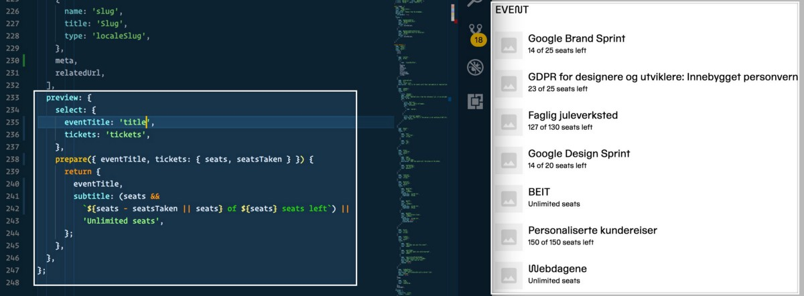

](img/1__azZfpt4kUruNCGOalYBrtg.png)
Illustration from [sanity.io](https://sanity.io)

When [Netlife](https://www.netlife.com) decided to rebrand, we didn’t only do so with [a new visual identity that included our own typeface](https://www.underconsideration.com/brandnew/archives/new_logo_and_identity_for_and_by_netlife.php), but we also decided to explore new technologial frontiers. We’d been very happy with our [previous website](https://retro.netliferesearch.com) built on top of [the versatile Craft CMS](https://hackernoon.com/20-principles-for-craft-cms-ae08d80c17de), but decided to explore if headless CMSes with a detached front-end on the web lived up to the hype (spoiler: they do).

We had already begun mouse clicking our way towards a rudimentary information architecture in another solution, when friends from [Bengler](https://bengler.no) showed up with [Sanity](https://sanity.io)–a CMS they have been developing for the last three years and have established a new company for. I took a crack at it and was quickly convinced when it took less than a day to recreate from scratch what we just spent a couple of weeks on, just by writing simple [JavaScript](https://hackernoon.com/tagged/javascript) objects in Sanity. Even though it was in beta, we decided to go for it as the back-end for our new website, and have never looked back.

#### If you’re considering going headless, here’s 5 reasons you should consider giving Sanity a spin:

### 1\. You’ll be up and running in 2 minutes. 🏃

Launch your terminal, write `npm install -g @sanity/cli && sanity init`, follow a few instructions, and you’re pretty much set to go. I recommend taking the offer of starting with the “Movie database schema” if it’s your first time. By following [the schema instructions](https://www.sanity.io/docs/reference/schema-types), the data types and the content fields are defined in simple JavaScript. Once you get the hang of it (i.e. mostly remembering the data types), you can sit down with your editor colleagues and quickly build, test, and tweak the Content Studio to something that makes sense to them. It has hot module reloading which means you can see your changes instantly. Lean and mean!

$ npm install -g @sanity/cli && sanity init  
updated 1 package in 14.462s  
This utility walks you through creating a Sanity installation.  
Press ^C at any time to quit.  
Looks like you already have a Sanity-account. Sweet!  
? **Select project to use** Create new project  
? **Informal name for your project** test-project  
? **Name of your first data set:** production  
? **Output path:** ~/Sites/SanityDemo  
? **Select project template** Clean, minimal project  
✔ Bootstrapping files from template  
✔ Resolving latest module versions  
✔ Creating default project files  
✔ Fetching packages      ▪▪▪▪▪▪▪▪▪▪▪▪▪▪▪▪▪▪▪▪ 100% (0.68s)  
✔ Linking dependencies   ▪▪▪▪▪▪▪▪▪▪▪▪▪▪▪▪▪▪▪▪ 100% (14.26s)  
● Linking dependencies   ▫▫▫▫▫▫▫▫▫▫▫▫▫▫▫▫▫▫▫▫ 0% (0.00s)  
● Linking dependencies   ▫▫▫▫▫▫▫▫▫▫▫▫▫▫▫▫▫▫▫▫ 0% (0.00s)  
✔ Saved lockfile

Success! You can now run "sanity start"

While other headless CMSes provide a control panel for editing the content models and fields, I prefer to do it in code. That means it’s easier to reuse patterns across projects. While it’s wise to keep this code fairly verbose and simple, you can also [generate fieldsets by iterating over arrays and so on](https://www.sanity.io/docs/content-studio/localization). You can also modularise the usual suspects, such as a title field. It’s pretty nifty!

 type you’ll get the rich text editor. Adding other types to the array gets available in the ‘insert’ menu. Yes, rich text is just an array where one of the types happens to be block text.](img/1__V9aaHWgYi0E3__vwfYAedDA.gif)
Starting from scratch is easy. If you put a [\`block\` type in an \`array\`](https://www.sanity.io/docs/schema-types/block-type) type you’ll get the rich text editor. Adding other types to the array gets available in the ‘insert’ menu. Yes, rich text is just an array where one of the types happens to be block text.

### 2\. You can edit the editor 🖋🔧

What makes Sanity stand out is that its editor, i.e. [_Content Studio_](https://www.sanity.io/docs/content-studio)_,_ can be tweaked, extended and tailored to whatever you need. The first step is to configure the previews of your content. This is done by attaching a `preview` object to the type you want to display in the preview. You can also customize it even more by sending whatever you’ve selected through a `prepare` function.

We use Sanity for handling registrations to workshops and other events. Here we can preview how many seats there are left on each event.

We have already begun to use Sanity for client work. In one our projects with the [U4 Anti-Corruption Resource Center](https://beta.u4.no) (still under development!) they wanted to integrate the rich text field with a service for text analysis to help them keep track of text quality. I’m no React expert, but I managed to extend the rich text editor to include a line with a small selection of the many data points provided by [readable.io’s API](https://readable.io). You can see the proof of concept underneath. We have also made a spreadsheet-ish input field for creating and editing tabular data, and rumour has it that there exists an input field for a live 3D rendering of protein molecules(!).

I set the editor to check the text every five seconds of writing. It’s also interesting to have the running estimated reading time while you write. Hopefully it will encourage brevity.

### 3\. GROQ gives you API superpowers 🚀

The whole reason of choosing a headless [CMS](https://hackernoon.com/tagged/cms), is that the content can be accessed through APIs. Typically that has been RESTful APIs, which can be somewhat of a hassle to manage. Although it often make sense, building a slightly advanced website, or any application really, on such APIs can also be a hassle. Especially when you’re required to query the API many times in order to get the necessary IDs to get the data you want. This is partly why Facebook made [GraphQL](http://graphql.org), which now seems to be the weapon of choice for up and coming headless CMSes and “[backends as a service](https://graph.cool)”.

[Sanity doesn’t come with GraphQL](https://www.sanity.io/docs/front-ends/what-about-graphql) (yet), but arguably something much better: [GROQ](https://www.sanity.io/docs/front-ends/query-cheat-sheet). The first thing I thought on seeing it was that it felt like “Markdown for GraphQL”. The syntax is also something you’ll have to get a little used to, but oh man, once you are: 🚀. If you wanted to query for the articles I made in the example above, it would be as easy as typing `*[_type == 'article']`, but you can also go a bit crazy with it:

. It is way easier to write than to read: “Fetch documents with the type ‘topics’ and return the title in addition to the number of documents of the types ‘publication’ and ’helpdesk’ that references each ‘topics’-document and place them under the key ‘relatedCount’, sort this array after this count descending from the largest, and give only the five most referenced topics-document”.](img/1__T1izRBuf6C4rN__g47uEyDw.jpeg)
We use a version of this query to generate [the topic list on U4](https://beta.u4.no/topics). It is way easier to write than to read: “Fetch documents with the type ‘topics’ and return the title in addition to the number of documents of the types ‘publication’ and ’helpdesk’ that references each ‘topics’-document and place them under the key ‘relatedCount’, sort this array after this count descending from the largest, and give only the five most referenced topics-document”.

### 4\. The underlying technology is super boring 💤

Despite the fact that you configure the data schemas and the content studio locally, Sanity CMS is cloud hosted, and all the _data_ is instantly synced, which means that the studio is also _real-time_. Making your Content Studio configuration available to others is a simple`$ sanity deploy` in the terminal. With the promise of being able to host myriads of documents, it’s reassuring that underneath Sanity you’ll find such mature and super boring technology as PostgreSQL, ElasticSearch, and JavaScript (well, there _is_ some exciting tech also in the secret sauce that makes Sanity so blazing fast). We also feel safe that React isn’t going away anytime soon. No HTML or XML is saved in the database, not even the rich text, everything in sensible object-structures: e.g. you don’t want to have to parse HTML in order to make Alexa read from your text fields. With Sanity you can even make a editor that let’s you mark text for cadence and such, for when voice-interfaces support that.

Sanity comes with its own maintained and sober JavaScript-, HTML-, and PHP-clients, so that you’re also up and running fast with whatever front-end you want to attach this to. Writing and updating data via the API is also easy, even with transactions (yes, it has transactions!). You want that stuff to be boring, especially if your content and data is important to you. Sanity is built to make it a bit hard for you to lose or screw up your data.

At time of writing, the pricing for hosting and SLAs are not yet announced, but we’re pretty sure it will be sensible both in terms of expense and features. It will also be used in the academic sector [to power a solution for online research publications](https://vegapublish.com/).

### 5\. It’s finally easy to work with headless content models—for everybody 🙇‍♀🙇

 we can also use Sanity to provide real content when designing new interfaces.](img/1__EoRDlRFYv8IHS__LYFQU0vg.gif)
With the [Craft by Invision plugin](https://www.invisionapp.com/craft) we can also use Sanity to provide real content when designing new interfaces.

In order to get started with Sanity you are for the time being dependent on someone with rudimentary knowledge of JavaScript. Nevertheless, it being of the most popular programming languages of the web, such a person shouldn’t be to hard to get by. What we truly love about this CMS is that it invites the technologists, visual-/interaction-designers, and content editors to work closer together on creating an information architecture that makes sense for what it’ll be used for.

#### We are headless over heels in love! 💚

There’s something powerful in being able to adjust and tweak the content model, the input fields or even the preview during a meeting or workshop just to test out the suggestions. The fact that new content fields are _instantly_ reachable through the APIs once they’re made, removes so much friction for front-enders. We have never before been able to so effortlessly build an information architecture so that both front-enders and content editors can experiment with it instantly. The devil is also in all the little details that are too many to explore in this post, but to highlight some of them: Sanity analyses the color schemes of your images (say goodbye to text-on-image contrast troubles!), handles pastes from Microsoft Word handsomely, lets multiple users edit the same documents at the same time, exports and imports the whole dataset with one terminal command, has CDNs, has plugins to preview OpenGraph-tags, lets you write your own plugins to the studio with a simple `sanity init plugin`, lets you make your own marks and annotations in rich text, and lets you ask for your images in whatever size, crop or rotation you want. The list goes on and grows every week.

Neither has it ever been so easy to tailor the very editor it all happens in – it makes for new and exciting ventures!

_It should be noted that we have no financial ties to Sanity, other that we use it to help our clients, whom we bill by the hour. If you’re interested in trying out Sanity you can learn more by reading through its_ [_documentation_](https://sanity.io/docs)_. We’re sure the folks at Sanity appreciate feedback, questions on either_ [_gitter_](https://gitter.im/sanity-io/sanity?utm_source=badge&utm_medium=badge&utm_campaign=pr-badge&utm_content=badge) _or in the various_ [_github-repos_](https://github.com/sanity-io/sanity)_._

**_If you’re interested in working with Netlife on a project with Sanity, just send us_** [**_a good old fashioned email_**](mailto:hei@netlife.com)**_, and we’ll figure something out!_**

](img/1__uP92O7Olv9PXBnU__KGw98Q.jpeg)
Knit your content together with Sanity. Illustration from [sanity.io](https://sanity.io)