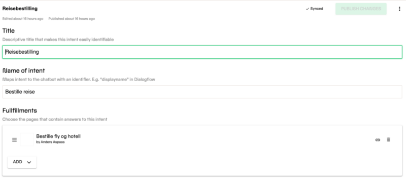
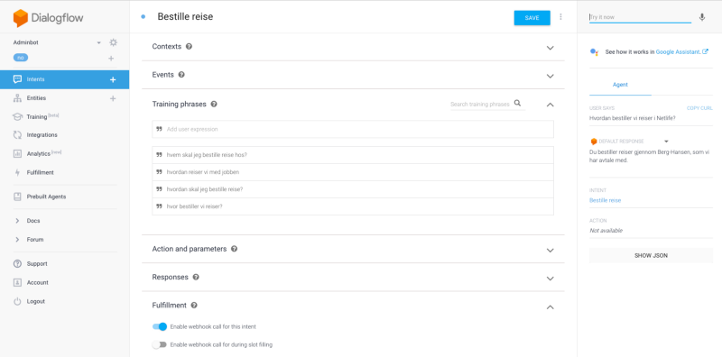
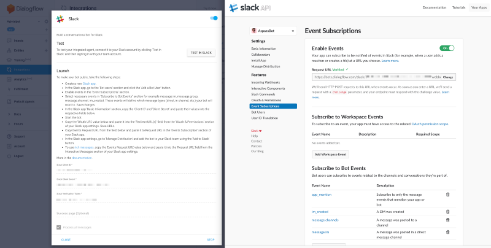
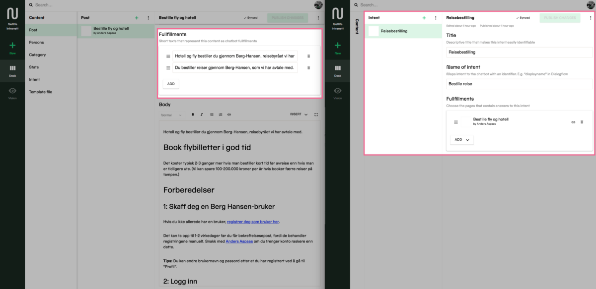
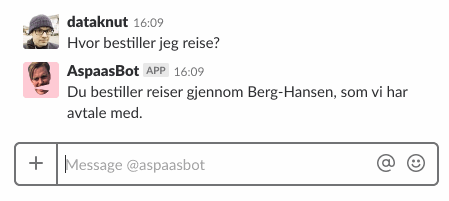

Make intents for chatbots and conversational UIs a part of your content management system

_Heads up! You’re required some knowledge of JavaScript to do this tutorial, but it may still be interesting for how we think about integrating chatbots into a CMS._

The idea of a [headless content management system](https://en.wikipedia.org/wiki/Headless_CMS) is to detach your content from the constraints of web pages, in order to reuse it in many contexts. This makes sense even when you only want to display your content on a webpage, because you can structure it in a way where content can be reused across many pages, and more easily switch your frontend code when something more fancy comes around. The real power of headless, however, comes when you manage to reuse your content in different interfaces.

Chatbots have been part of the tech buzz for a while now, and it seems that demand is increasing while the tools and AI models become more refined. Google’s [Dialogflow](https://dialogflow.com) just launched support for my native language, Norwegian, which proved a good excuse for me to do some experimentation. I have been pondering for a while how we could implement chatbot-responses with the headless [CMS](https://hackernoon.com/tagged/cms) we use at [Netlife](https://www.netlife.com), which is Sanity ([read more about why we chose Sanity here](https://hackernoon.com/headless-in-love-with-sanity-689960571dc)). I think I found a pattern that is easy to implement and maintain.

#### In sum, you’ll need to:

1.  Set up an agent in [Dialogflow](https://console.dialogflow.com)
2.  Make a [custom app in Slack](https://api.slack.com/apps), and [connect it to Dialogflow](https://dialogflow.com/docs/integrations/slack)
3.  Add some intent and fullfillments schemas in Sanity
4.  Connect Sanity and Dialogflow with a serverless service, in this case [webtask.io](https://webtask.io/make)

### I. Make an agent and an intent in Dialogflow

Once logged into Dialogflow, choose **Create new agent** and give it a name and choose appropriate settings (I chose the V2 API). In my case I wanted to make a [chatbot](https://hackernoon.com/tagged/chatbot) that could connect our company’s intranet with Slack. I named it after our Chief of Staff (a role which, granted, never can be fully automated).

Once you’ve made a new agent, go to **Intents** and choose the **Create Intent** button. You can think of an “intent” as “a certain thing that a user would want to do or have answered”. My intent was to get an answer about how we in Netlife book travel. Give the intent a descriptive name; we’ll use this name in Sanity to map the correct content. Fill out different training phrases, which are examples of what your users would write or say(!) in order to request the said information. In this case, it’s variations on “how do I book travel” and so on. Hopefully you’ll won’t need to enter many alternatives before Google’s machine learning algorithms are able to route the user to this intent. You can test how well it works in the right hand sidebar.

Set up an intent in Dialogflow, test it in the right hand sidebar. Here I have set up alternatives in Norwegian for the question “how do I book travel”

You can write out the different possible answers for this intent in Dialogflow’s **Responses**\-sections, but where’s the fun in that? Instead, turn on **Enable webhook call for this intent**. This will make Dialogflow post a request to whatever URL you put in the **Fullfillment** section. We will return to this when we set up our microservice in webtaks.io.

### II. Make an custom app in Slack and connect it to Dialogflow

If you go to **Integrations** in the left sidebar in Dialogflow, you’ll discover that it can integrate with many different services. The setup will be pretty similar with most of them, but we want Slack. Follow the instructions in **Settings** in the Slack box closely. And by “closely” I mean that you should take your time to read the instructions and try to understand them.

Make sure that you give the Slack bot the necessary event subscriptions.

Your Slack-bot will need both some authentication and event subscriptions in order to be able to read your queries in Slack. You could have it listen to all conservations, but I prefer it to only answer direct or @-mention messages. Partly because I don’t want the bot to accidently trigger in mid conversation, and partly because I don’t want to feed Dialogflow every line of conversation in our Slack if there is not a very good reason to.

### III. Add some schemas for intents and fullfillments in Sanity

If you are not familiar with Sanity yet, [go try it out](https://sanity.io) and be back here in fifteen minutes. The content schemas (i.e document types and input fields) in Sanity [are written as JavaScript objects with some simple convetions](https://www.sanity.io/docs/content-studio/the-schema). We’re going to make a pretty simple setup by creating a type for **Intents** and adding a content field for **Fullfillments** in our intranet-post-type.

In our post type, where we write the articles for our intranett, I added an array field called **fullfillments** that consists of a simple **string** field. We could make this more complex in order to support messages for different clients; for example, we could have one for [voice interfaces](https://developers.google.com/actions/reference/ssml), one for [Slack responsens with attachments](https://api.slack.com/docs/messages/builder) and one for [Facebook messenger templates](https://developers.facebook.com/docs/messenger-platform/send-messages/templates). This time, we’ll keep it simple and just have some simple text responses do the work.

The intent schema consists of a title that makes it easy to find in Sanity, a **intentName** that we’ll use to map it to that in Dialogflow and a reference field to the posts that contain the fullfillments to this intent. It makes sense to make intents its own type, because the fullfillments can live in different types.

Don’t let the Norwegian throw you off.

### IV. Tie it all together with webtask.io

Now that we’ve set up Sanity with a intent and a fullfillment, we’re ready to connect it to Dialogflow. This is a case where serverless functions comes in handy. I went with [webtask.io](https://webtask.io) because I had used it before and it has an online editor, but you could easily replicate this with either [AWS Lambda](https://aws.amazon.com/lambda/), [stdlib](https://stdlib.com/), [Google Cloud Functions](https://cloud.google.com/functions/) or any server(less) technology to your taste. In any case the core of the function will be very similar to this gist.

The Sanity query can be read as the following: “Get all entries with the type intent that has the same string in the intent name field as the incoming intent from Dialogflow. Take the first (and in most cases only) of these entries and put it in an object; under the key “fullfullments”, list out all the referenced documents, follow the references to their entries and return a list of the strings in the fullfillment field.
](img/1__jRrpOoUI5H__cudrso__hngg.png)
Example of the query in work using the [Vision plugin for Sanity.](https://www.npmjs.com/package/@sanity/vision)

This is proof of concept code and could benefit from some more error-handling and such. Webtask isn’t too keen on ES6-syntax either. You should pay attention to line 13 and how we locate the correct intent in Sanity. This is why it’s important to align the intent name in Dialogflow to that (i.e. intentName) in Sanity. In this case I’ve also chosen ouput the fullfillment strings randomly, just to make some variations possible.

If you managed to piece all this together, you should now have a working chatbot in Slack that parses natural langauge for intents with machine learning in Dialogflow, finds the fullfillment texts from your headless CMS via a serverless function that talks to APIs. Now you only need to add Blockchain somewhere in this mix to tick off all the buzzword boxes. Further on, we could also connect intents in Dialogflow directly to Sanity via APIs and so on. There are many ways to advance this.

_Figure: The Slack chatbot at work. I’m trying variations on “how do I order travel”. We can see some encoding issues, and that we need some more training. But it is amazing technology for mundane uses._

This is of course the technical side of the design project. Now the real work begins, with researching what your co-work uses actually might want to ask the bot, and designing the useful answers wrapped in a personality that your coworkers actually want to engange with. I’d recommend picking up [_Conversational Design_](https://abookapart.com/products/conversational-design) by [Erika Hall](https://twitter.com/mulegirl) for starters.

_If you try this, or have some comments on my setup, I’d love to have your insights and questions in the comment section!_