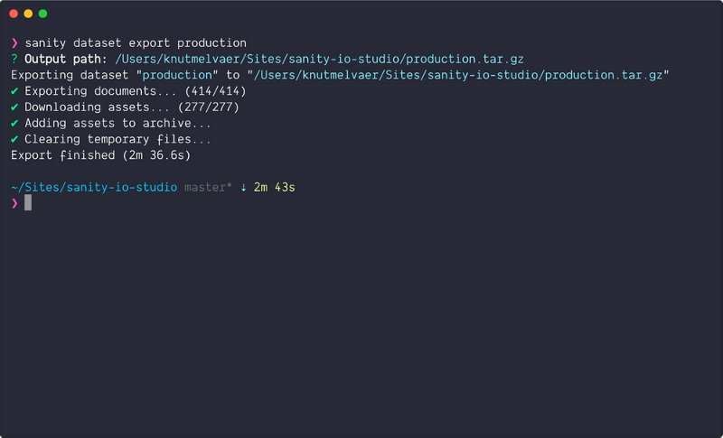

At the [Sanity Head Quarters](https://www.sanity.io), we live and breathe in the terminal. And honestly, we keep developing the Sanity CLI [tool](https://hackernoon.com/tagged/tool) because we use it ourselves every day to interact with our structured content. I want to take this moment to share some of the cool things you can do with it.

**Install the CLI by running** `**npm install --global @sanity/cli**` **in your terminal and get started with a project by running** `**sanity init**`**.**

### 1\. Query your data

```
sanity documents query "*[_type == 'post']{_id, title}"
```

You can do a couple of things with the [sanity documents command](https://www.sanity.io/docs/documents), but one of those we use the most is the one for [querying a dataset](https://www.sanity.io/docs/data-store/how-queries-work). Running this in your project folder will give you your data printed out right in the terminal. If you add `--pretty`, you'll get some nice highlighting too. This is handy for testing queries and exploring your content, but if you think about it, it's also a way to use those UNIX superpowers on your content. For example, you can use it to [export your data to a csv file](https://www.sanity.io/blog/exporting-your-structured-content-as-csv-using-jq-in-the-command-line). I use it so often that I have added `alias sdq="sanity documents query"` to my [shell configuration](https://medium.com/@rajsek/zsh-bash-startup-files-loading-order-bashrc-zshrc-etc-e30045652f2e).

### 2\. Export a dataset in a neat package

```
sanity dataset export <datasetName>
```

The whole point of a structured content management system is that it should be easy to get your content out of it. Usually that’s by querying the API for the content you want, but sometimes, you want it all, at once, neatly packaged. This command exports all your documents in a `.ndjson`\-file and your assets to a dedicated folder. It downloads a gzipped file, which you also can import to a new dataset with `sanity dataset import`. You can also, for example, unpack the file, run a find-and-replace-all operation on all your data, and import the `dataset.ndjson` file to a dataset again.


Getting _ALL THE DATA_

### 3\. Manage CORS settings

```
sanity cors add http://localhost:8000
```

[CORS is a thing](https://www.sanity.io/docs/browser-security-and-cors). It’s easy to forget it when you’re on a roll building your new frontend. Then it’s nice to have an easy way to add a new CORS origin right from the command line. You can `delete` and `list` them out too.

### 4\. Get an overview of your projects

Since you can have as many [free developer plans](https://www.sanity.io/pricing/dev-2018-08-21) as you desire, and starting a new [project](https://hackernoon.com/tagged/project) (`sanity init`) is rather easy, it doesn't take long before you have a handful of projects in your account. Then it's nice to have an easy way to list out all the projects with some key information tied to your account.

### 5\. Create and edit a document in your favorite editor

```
sanity documents create --id myDocId --watch --replace
```

This command is my favorite. It creates a new document, opens it in the EDITOR you’ve set in your terminal (mine is `export EDITOR='code -w'`), and lets you live edit that document while it's being synced to the datastore. If you put an existing document id in the `myDocId` spot, you'll get that document and be able to edit it. Run `sanity documents create --help` to learn more about what this command can do.

It’s truly headless when you can edit content live from your favorite editor.

Get started with [Sanity](https://www.sanity.io) by running this command in your terminal:

```
npm install -g @sanity/cli && sanity init
```

_Originally published at_ [_www.sanity.io_](https://www.sanity.io/blog/5-cool-things-you-can-do-with-the-sanity-cli)_._