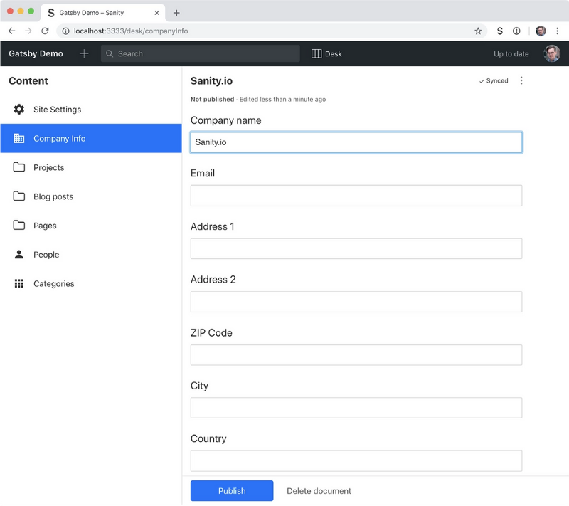
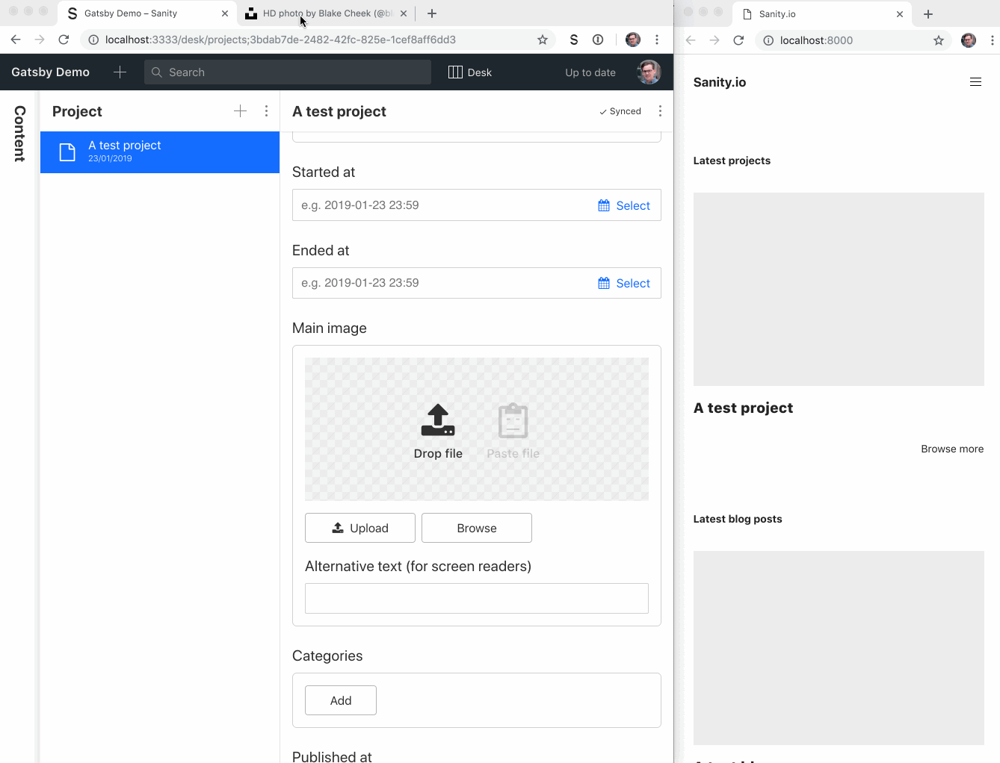
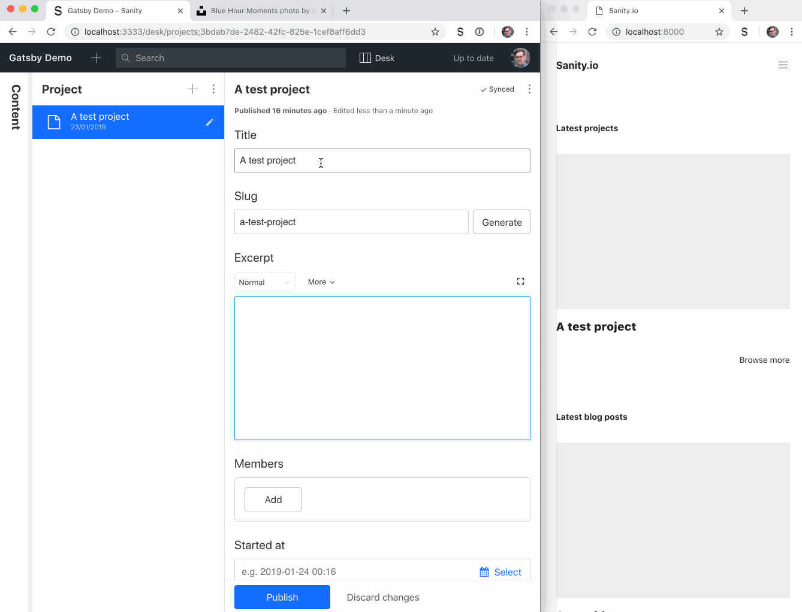
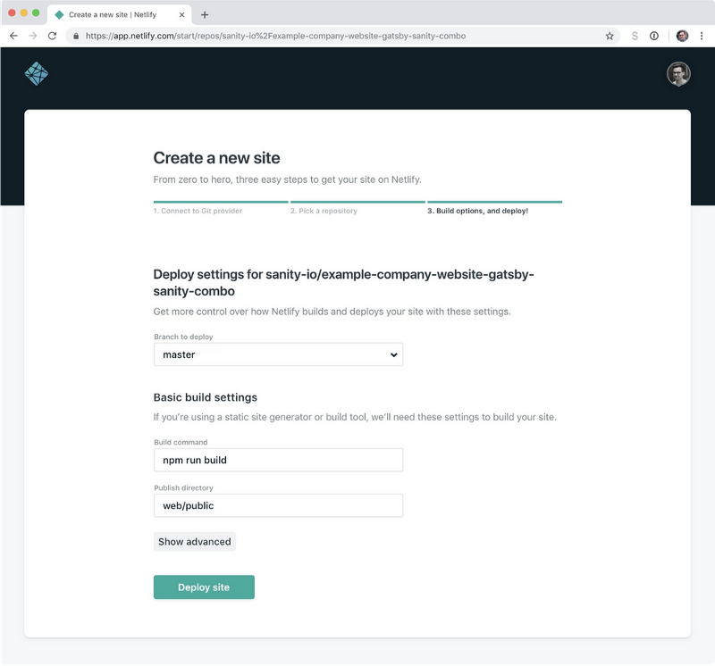

There’s a [new source](https://www.sanity.io/blog/get-started-with-gatsby-and-structured-content) plugin out that makes it easy to use Sanity as a headless CMS for a JAMstack website built with [Gatsby.js](https://www.gatsbyjs.org). It’s pretty easy to install and integrate with exciting projects on [Gatsby](https://hackernoon.com/tagged/gatsby). If you’re new to the static site generator, or want to test the plugin out, we made [a full company website and a headless CMS example](https://github.com/sanity-io/example-company-website-gatsby-sanity-combo), with people, projects, a blog, and some info pages. In this tutorial we’ll show how to set it up, and how to run Gatsby in [development](https://hackernoon.com/tagged/development) mode on a web server, to get a real-time online preview of content changes.

The example is a monorepo, containing both the configuration for Sanity Studio, where you’ll be editing content, and the Gatsby built website. It’s also configured to be deployed straight onto [Netlify](https://netlify.com/) or [Now](https://zeit.co/now). You can create a new free Sanity project within it, and be up and running in minutes. Web development in the age of [JAMstack](https://jamstack.org/) is truly fantastic!

We feel safe that you can take our company website example, and make it your own.

### Clone or fork the repository on Github

Go to the [example repository on GitHub](https://github.com/sanity-io/example-company-website-gatsby-sanity-combo) and clone, or fork it from there. You can also run this in your terminal in the folder you keep your web-projects (replace the URL with your own if you forked the project):

git clone [https://github.com/sanity-io/example-company-website-gatsby-sanity-combo.git](https://github.com/sanity-io/example-company-website-gatsby-sanity-combo.git)  
cd example-company-website-gatsby-sanity-combo

### Install the Sanity CLI

It’s convenient to have the Sanity CLI when working with projects like this, and it doesn’t take long to install. Run the following npm command in the command line:

npm install --global @sanity/cli

### Install dependencies

This example use [node package manager](https://npmjs.com/) (`npm`) for dependencies, you can also use yarn if you prefer that:

~/example-company-website-gatsby-sanity-combo   
npm install

### Set up Sanity.io as a headless CMS

~/example-company-website-gatsby-sanity-combo   
npm run init

Run this command after the install script is finished. Follow the CLI’s instructions to create a Sanity.io project for the website. We recommend setting the dataset to **public** (you can change it to private afterward if you prefer). A **dataset** is where all you store all your content, kind of like a database. You can have more than one dataset. For example if you want a content test bed for development.

The `npm run init` command also deploys a GraphQL API for your Sanity project (Sanity supports both [GROQ](https://www.sanity.io/docs/reference/groq) and GraphQL). The Gatsby source plugin for Sanity uses the GraphQL schema definition to prevent types and fields missing from Gatsby’s templating API. As far as we know, this is the only plugin that helps you with that – it's pretty practical!

### Start the local development server

In your project folder you have two folders: `studio` and `web`.

The studio folder is where you’ll find the configuration files for the Sanity Studio, which is an open source editor for your content, built with JavaScript and React. It connects to the hosted API and is real-time, like you have in Google Docs. You can host the Studio anywhere you can host an HTML-file. In the `studio/schema` folder you'll find the configuration files for all the types and fields. You can tweak and change these later if you want to, but we'll let them be for now.

The `web` folder holds a Gatsby website, with everything you need set up to render the content managed with Sanity. If you're new to Gatsby, we recommend their [comprehensive documentation](https://www.gatsbyjs.org/docs/) to learn the basic ideas.

You can start both development servers for the Studio and the Gatsby frontend with a single command:

~/example-company-website-gatsby-sanity-combo   
npm start

The studio runs on [localhost:3333](http://localhost:3333/), and the website on [localhost:8000](http://locahost:8000/). If you open the website you’ll be met with an error message. That’s because it needs some content to build. So start by opening the studio and log in.



Go to [Site Settings](http://localhost:3333/desk/siteSettings) and [Company Settings](http://localhost:3333/desk/companyInfo) and fill in at least the names. Make a blog post (just some mock content is fine), a project, and some of the other stuff as well. You should give both your blog- and project entries a **title**, a **slug** and preferably a **Published at** date (in the past). Remember to publish the changes (the blue button down left). Although all changes instantly sync with the hosted backend, they won’t appear in the public API without being published.

Now you probably need to restart the development server, to get Gatsby to build with the new changes. `ctrl + C` will quit the current process, and `npm start` to start it again.

### Try out watch mode for Gatsby

If you look at the file called `gatsby-config.js`, you'll see the following entry in the plugins section:

```
{  resolve: 'gatsby-source-sanity',  options: {    projectId,    dataset,    // To enable preview of drafts, copy .env-example into .env,    // and add a token with read permissions    token: process.env.SANITY_TOKEN,    watchMode: true,    
```

We have enabled `watchMode`, which means that Gatsby injects content changes on the fly, without you having to reload the development server, or refresh the browser. Few other source plugins do this. What's even cooler, is that other people can sit in the same studio, and edit content, and that too is instantly reflected on the frontend development server. The plugin only get access to published changes by default, but try editing something (maybe add an image to the first blog post), push **Publish** and see if it updates in the frontend.



### Add token to see all changes

In the plugin, you maybe noticed `token: process.env.SANITY_TOKEN` and `overlayDrafts: true`. With a `token` with read privileges you give Gatsby access to unpublished documents, such as drafts. When `overlayDrafts` is set to `true`, Gatsby will use the draft version of a document if it has access to it. You'll need to save a read token in a file called `.env` in the web folder to enable this:

~/example-company-website-gatsby-sanity-combo/web   
cp .env-example .env

Now you can go to [https://manage.sanity.io/projects/<YourProjectId>/settings/api](https://manage.sanity.io/projects/) (Manage -> Settings -> API), and **Add New Token**. Give it a nice descriptive label, and only read rights. Copy it, and paste it in the .env file:

~/example-company-website-gatsby-sanity-combo/web/.env  
SANITY\_TOKEN="YourToken"

To load the token into Gatsby, you’ll need to restart the local development server again. It will be worth it though.



### Get your Gatsby site on the web with Netlify

Maybe you want to tweak the frontend a bit, change the CSS, or make some adjustments. At some point you want to share it with the world though. We recommend that you put your project on GitHub. If you forked it, commit and push your changes. If you cloned it from us, [follow these instructions](https://kbroman.org/github_tutorial/pages/init.html) on how to get a local git repo on GitHub.

When it’s on GitHub, head over to Netlify and sign up or log in. If you choose **New site** from Git and find the repository you just updated, everything is set up and ready, thanks to the `netlify.toml` file in the project. Likewise, if you prefer [Zeit’s now](https://zeit.co/now) (or want to use both for ultimate redundancy), you can run `npm run now-deploy` in the root folder of the project.



To quickly deploy the Sanity studio, run `sanity deploy` in the `studio` folder and choose a hostname. Now you can invite two additional users for free on the forever-free developer plan. If you need more, it's $10 per user on the pay-as-you-go on the same plan. Gatsby only uses 2 API request to build the whole site. One for all your content, and one for the schema. So you will get great mileage [with our free plan](https://www.sanity.io/pricing/dev-2018-08-21) with a Gatsby website. We dig it!

### Trigger new Netlify builds on content changes

Netlify triggers new builds when you push commits to a branch that it monitors. The content, however, is not committed to Git. Fortunately, there are other ways of triggering builds, one of them is using webhooks.

If you host your site on Netlify, you can go into **Settings** -> **Build & Deploy** and scroll down to **Build Hooks**. Choose **Add build hook**, give it a name, and point to the branch you want to build from. Copy the URL, and return to the terminal:

~/example-company-website-gatsby-sanity-combo  
cd studio  
sanity hook create  
? Hook name: netlify  
? Select dataset hook should apply to: <yourDataset>  
? Hook URL: https://api.netlify.com/build\_hooks/<someId>

Now Netlify triggers a new deploy of your site everytime you publish some new content edits.

### BONUS: Content preview online on Heroku

[This helpful tutorial](https://awesomereact.com/custom-gatsby-preview-with-heroku) by Andreas Keller popped up in our feed. He has figured a way to run Gatsby on a development server on Heroku, hence making it possible to get that watch mode with live previews experience on the web. Which is nice if you have editors that can’t be expected to run a local development server in the terminal. Let’s set it up with the Sanity source plugin to get an unparalleled preview experience!

### Install the Heroku CLI

Follow [these instructions](https://devcenter.heroku.com/articles/getting-started-with-nodejs#set-up) to install the Heroku CLI. Run `heroku login` and log in or sign up.

### Tweak gatsby-config.js

To get Heroku to play nice with the monorepo (it likes its apps in the root folder), we must install the gatsby-cli as a dev dependency in the root folder:

~/example-company-website-gatsby-sanity-combo  
npm install gatsby-cli --only=dev

There are also other [ways of doing it](https://github.com/timanovsky/subdir-heroku-buildpack) where you push the `web` folder, but then you have to put in the `projectId` and `dataset` manually in `gatsby-config.js`, as these variables are imported from `sanity.json` in the `studio` folder.

Once you’re set, you should do the following:

~/example-company-website-gatsby-sanity-combo  
\# create a new heroku app  
heroku create  
  
\# set node to run in development mode  
heroku config:set NODE\_ENV=development  
heroku config:set NPM\_CONFIG\_PRODUCTION=false  
  
\# set the project id and dataset, found in sanity.json  
heroku config:set PROJECT\_ID=YourProjectId  
heroku config:set DATASET=YourDatasetName  
  
\# add the read token to Heroku’s environment  
\# make sure that the token isn't wrapped in quotation marks  
heroku config:set SANITY\_TOKEN=$(cat web/.env|grep SANITY\_TOKEN)  
  
\# add the app configuration to run gatsby on heroku’s dyno  
echo "web: cd web && gatsby develop -p $PORT -H 0.0.0.0" > Procfile  
  
\# add the changes to git  
git add Procfile package.json package-lock.json  
git commit -m"Add Procfile and deps for Heroku"  
  
\# push it to heroku  
git push heroku master  
  
\# open the app in the browser  
heroku open  
  
\# check the logs to troubleshoot if things doesn't work  
heroku logs --tail

This app runs on a free dyno that sleep after a time of inactivity, and it can take some minutes to start up again. You can of course run it on a paid dyno which gives you full uptime. We cannot guarantee that it will be very stable, since the development server isn’t built to actually host a website on the web. If it crashes, you can restart it with `heroku restart`.

It’s pretty cool nonetheless, and undoubtedly useful when you want to give your web editors a way to preview their changes instantly, without having to wait for rebuilds.

_Originally published at_ [_www.sanity.io_](https://www.sanity.io/blog/how-to-quickly-set-up-a-gatsby-js-jamstack-website-with-a-headless-cms)_._